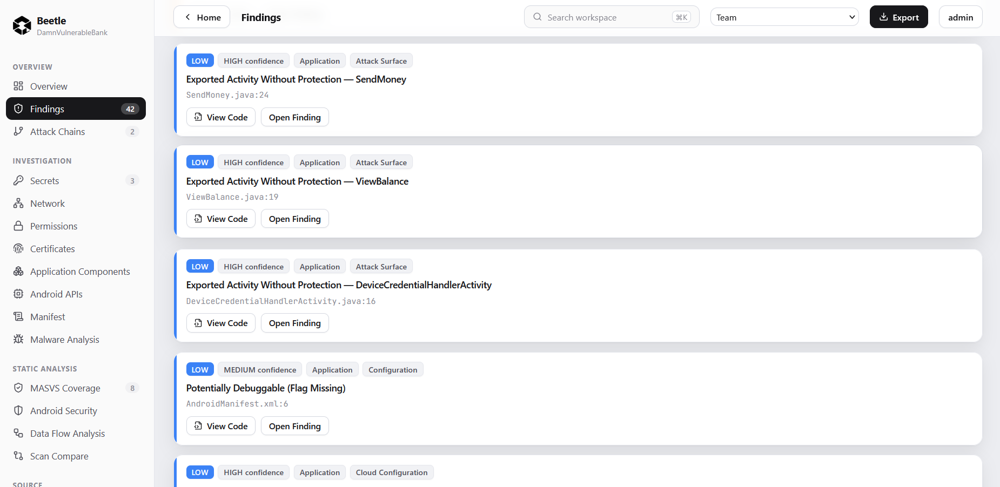
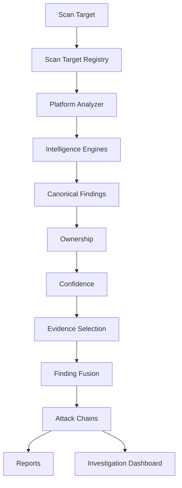

<p align="center">
  
</p>

<p align="center">
  <a href="https://github.com/f3rb123/beetle/releases"></a>
  
  
  
  
  <br>
  
  
  
  
  
  
  
</p>

<h1 align="center">🪲 Beetle</h1>

<p align="center"><strong>Attack-Chain Driven Mobile Application Security Platform</strong></p>

<p align="center">
Android • iOS • Flutter • React Native • OWASP MASVS • Attack Chains • Source Navigation • SARIF • CycloneDX SBOM • Optional AI • Docker
</p>

---

## Overview

**Beetle** is an offline-first **Application Security Intelligence Platform** for analyzing Android APKs and iOS IPAs, including apps built with **Flutter** and **React Native**.

It is built for **penetration testers, mobile security engineers, developers, security researchers, and auditors**, and brings together static analysis, explainable security intelligence, attack chains, source navigation, evidence-driven findings, professional reporting, and optional AI assistance in a single analyst workspace.

> Unlike traditional static analyzers that primarily enumerate findings, Beetle builds an explainable investigation workflow by combining evidence, ownership, confidence, finding fusion, attack chains, source navigation and optional AI assistance into a single analyst experience.

Beetle is **offline-first**: all analysis runs locally on your own infrastructure, and application binaries and source code are never uploaded to external services. The deterministic intelligence engines require no network and no AI provider to run a complete scan.

---

## Why Beetle?

A modern mobile application can produce hundreds of security findings. Beetle is designed around the analyst workflow — helping you decide *what is vulnerable, why it matters, and how an attacker could combine weaknesses* — rather than handing you an undifferentiated list.

* **Explainable findings** — every score and verdict ships with a human-readable reason
* **Evidence before assumptions** — findings are grounded in concrete artifacts (code, manifest, certificates, binaries)
* **Attack Chains** — isolated findings are correlated into realistic, evidence-backed attack paths
* **Source Navigation** — every finding links directly to its exact file and line
* **Standards Mapping** — OWASP MASVS coverage and OWASP Mobile Top 10 alignment
* **Offline-first** — complete analysis with no network and no AI provider required
* **Optional AI** — explain findings, reason about evidence, and answer security questions in context
* **Professional Reporting** — executive, technical, and compliance reports plus machine-readable exports

---

## Core Capabilities

* **Static Analysis** — Android APK + iOS IPA decompilation, manifest/plist, certificates, entitlements, and native binaries
* **Explainable Intelligence Engines** — Ownership, Confidence, Evidence Selection, Finding Fusion, Secret Intelligence, and more — each adds metadata without ever deleting a finding
* **Attack Chains** — correlate findings into realistic, evidence-backed attack paths
* **Source Navigation** — jump from any finding to its exact source location with a rich code viewer
* **Standards Mapping** — OWASP MASVS coverage and OWASP Mobile Top 10
* **AI Security (optional)** — an AI Assistant and AI Actions that augment, but never replace, deterministic analysis ([details below](#ai-security-optional))
* **Reporting & Integrations** — PDF, SARIF, CycloneDX SBOM, JSON, webhooks, and CI/CD policy gating

---

## AI Security (Optional)

Beetle performs **all security analysis locally** using deterministic intelligence engines. AI is a completely **optional** layer on top of that analysis.

> **AI does not scan applications. AI does not discover vulnerabilities.** It reasons only over Beetle's own findings and evidence, and it augments the analyst workflow.

The design philosophy is deliberate: detection and scoring must be deterministic, reproducible, and explainable, so they are never delegated to a model. AI is positioned strictly as an interpretation aid that helps analysts move faster through results that Beetle has already produced.

AI helps:

* **Explain findings** in plain language, including why they matter
* **Explain evidence** behind a finding
* **Answer security questions** about findings, controls, and attack scenarios
* **Suggest remediation** grounded in the finding's evidence
* **Generate executive summaries** from Beetle's findings and rollups
* **Assist investigations** across multiple findings or an attack path

If an AI provider is **not** configured:

* Beetle still performs **complete security analysis**.
* Investigation, reporting, and all deterministic intelligence engines continue working normally.
* Only AI-enhanced features require an AI provider.

**Supported providers:**

* Claude
* OpenAI
* Gemini
* DeepSeek
* Ollama (local / fully on-premises)

AI features require a configured provider — they are not available until one is set up.

---

## Features

### Mobile Security Intelligence

* Android Security Intelligence
* iOS Security Intelligence
* Flutter Security Intelligence
* React Native Security Intelligence

### Intelligence Engines

* Secret Intelligence v2
* Network Intelligence
* Cloud Configuration Intelligence
* APKLeaks Integration
* Semgrep Intelligence
* Ownership Engine
* Confidence Engine
* Evidence Selection Engine
* Finding Fusion Engine
* Attack Chain Intelligence
* MASVS Intelligence

### Investigation Workspace

* Engineering Workspace
* Investigation Dashboard
* Source Explorer
* Security Explorer
* Rich Code Viewer
* Source Resolution
* Trust Score
* Security Score
* AI Assistant
* AI Actions

### Reports & Export

* Executive PDF
* Technical PDF
* Compliance Reports
* SARIF Export
* CycloneDX SBOM
* JSON Export

---

## Screenshots

### Engineering Workspace

The home workspace — your entry point for scan targets, recent activity, and investigations.


### Scan Overview

A high-level overview of a scanned application: scores, finding rollups, and platform intelligence at a glance.


### Security Findings

The findings view — evidence-driven, confidence-scored, and mapped to standards.



### Open Finding

An individual finding with its evidence, ownership, confidence, and remediation context.


### Source Navigation

Jump from any finding to its exact file and line in the rich code viewer.


### Source Explorer

Browse the full decompiled and resolved source tree of the application.


### MASVS Coverage

OWASP MASVS coverage mapping across the analyzed application.


### AI Analysis

Optional, evidence-grounded AI analysis that explains findings and attack paths.


### AI Assistant

Conversational, context-aware security Q&A over your scan results.


---

## Architecture

Beetle ingests a scan target, registers it, runs the appropriate platform analyzer and detection engines to emit canonical findings, then enriches those findings through a chain of explainable intelligence engines before correlating them into attack chains and rendering them into reports and the investigation dashboard.



---

## Documentation

Beetle includes comprehensive technical documentation. The **Beetle Bible** is the single authoritative reference — it documents what every feature does, why it exists, how it works internally, and how an analyst should interpret its output.

* **[Beetle Bible](docs/beetle-bible/README.md)** — complete technical reference (architecture, engines, scoring, reports, FAQ, glossary)
* **[Architecture Guide](ARCHITECTURE.md)** — system architecture and pipeline
* **[Feature Inventory](FEATURE_INVENTORY.md)** — full inventory of implemented capabilities
* **[Project Overview](PROJECT_OVERVIEW.md)** — high-level project orientation

---

## Quick Start

### Clone the repository

```bash
git clone https://github.com/f3rb123/beetle.git
cd beetle
```

### Configure Beetle

Create a `.env` file (or export environment variables) with at least:

```env
SECRET_KEY=<minimum-32-character-secret>
CORTEX_ADMIN_PASS=<initial-admin-password>
```

Optional integrations:

```env
ANTHROPIC_API_KEY=...
VIRUSTOTAL_API_KEY=...
```

### Build the containers

```bash
docker compose build
```

### Start Beetle

```bash
docker compose up
```

The first startup may take several minutes while Docker builds and initializes the environment. Watch the startup logs until Beetle reports that the backend has started successfully, then open:

```
http://localhost:9005
```

The initial administrator account is created automatically during the first startup. You may optionally set the password with `CORTEX_ADMIN_PASS`; otherwise Beetle generates a secure random password. In both cases, the administrator username and password are printed in the container logs during initialization.

Stop Beetle at any time with `Ctrl + C`.

### Scan Duration

Typical scan times:

* Small applications: **5–10 minutes**
* Large applications: **10–20+ minutes**

> Initial scans may take longer because Beetle performs decompilation, framework detection, source indexing, evidence generation, intelligence correlation, attack-chain construction and report preparation before presenting results.

Actual duration depends on:

* CPU
* Available RAM
* Storage performance
* Application size
* Resource complexity

Scan times are not fixed — they vary with the host system and the application under analysis.

---

## Troubleshooting

### Administrator password not displayed

This usually happens because the Docker volumes already contain an initialized Beetle database. When the database already exists, initialization does not run again, so no new administrator credentials are generated or printed.

To completely reset Beetle:

```bash
docker compose down -v
docker compose up
```

> **Do not use `-d` here.** Run it in the foreground so you can watch initialization complete. The first startup may take several minutes.

Once initialization finishes, inspect the logs:

```bash
docker compose logs backend
```

The administrator username and generated password are printed **after initialization completes**.

> ⚠️ **`docker compose down -v` is destructive.** It removes:
>
> * Local database
> * Uploaded scans
> * Reports
> * Docker volumes
> * Persisted local data
>
> Use it only when you intentionally want to reset Beetle to a clean state.

---

## Supported Formats

| Platform     | Supported |
| ------------ | --------- |
| Android      | APK       |
| iOS          | IPA       |
| Flutter      | APK / IPA |
| React Native | APK / IPA |

---

## Current Capabilities

* Android, iOS, Flutter & React Native Security Intelligence
* Secret Intelligence v2
* Network Intelligence
* Cloud Configuration Intelligence
* APKLeaks Integration
* Semgrep Intelligence
* Ownership Engine
* Confidence Engine
* Evidence Selection Engine
* Finding Fusion Engine
* Attack Chain Intelligence
* MASVS Intelligence & OWASP Mobile Top 10 Mapping
* Engineering Workspace & Investigation Dashboard
* Source Explorer & Security Explorer
* Rich Code Viewer & Source Resolution
* Trust Score & Security Score
* AI Assistant & AI Actions (optional)
* Scan Target Architecture
* Executive, Technical & Compliance Reports
* SARIF Export & CycloneDX SBOM

---

## Roadmap

The following capabilities are planned for future releases:

* AI Security Intelligence
* Infrastructure-as-Code Intelligence
* Dynamic Security Intelligence
* Cloud Security Intelligence
* Enterprise Dashboard
* Team Collaboration
* Plugin SDK

---

## Design Principles

* Offline-first architecture
* Evidence before assumptions
* Explainable findings
* Analyst-focused workflow
* Standards-based security analysis
* Docker-native deployment
* Extensible architecture

---

## Contributing

Bug reports, feature requests, documentation improvements, and pull requests are welcome.

Please open an issue before submitting large feature changes so the implementation can be discussed first.

---

## License

See the **LICENSE** file.

---

## Acknowledgements

Beetle builds upon and benefits from the open-source mobile security ecosystem, including projects such as:

* JADX
* apktool
* LIEF
* Semgrep
* APKLeaks
* OWASP Mobile Application Security Verification Standard (MASVS)
* OWASP Mobile Security Testing Guide (MSTG)

Their work has significantly advanced mobile application security and made tools like Beetle possible.
