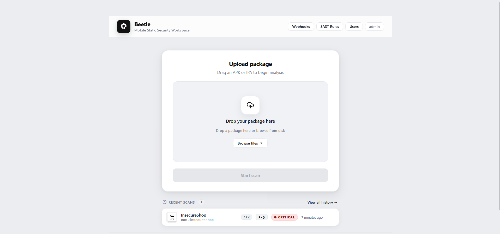
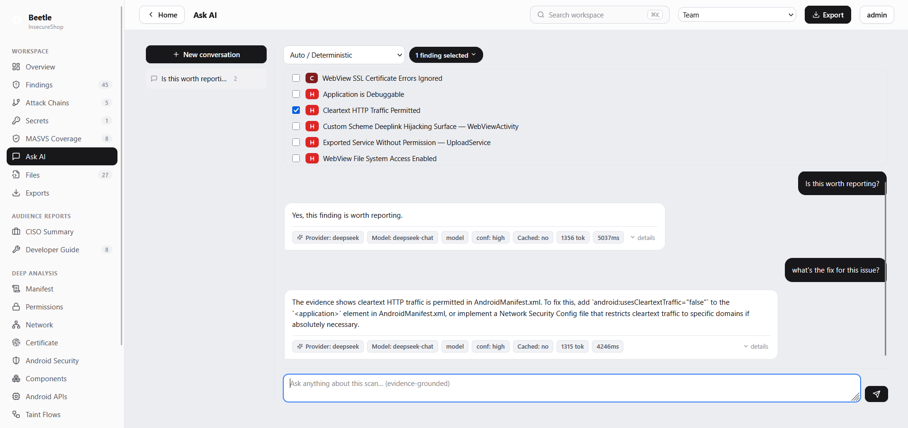
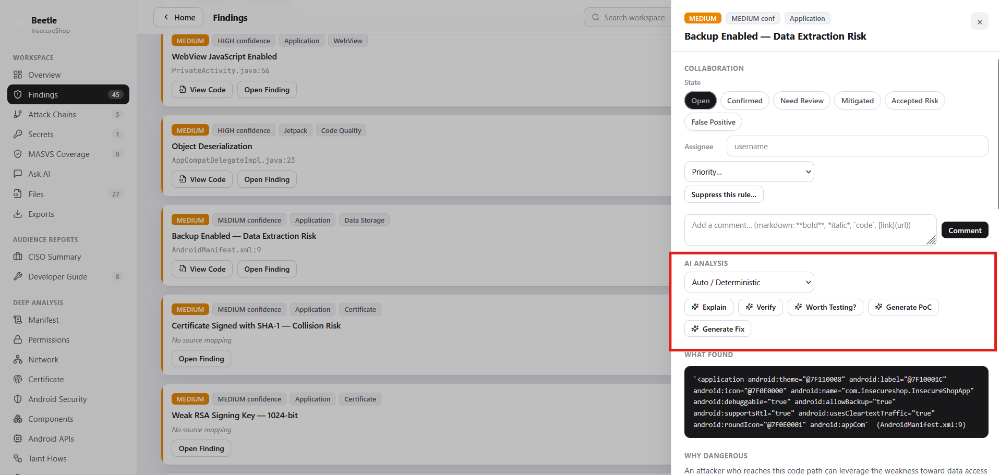
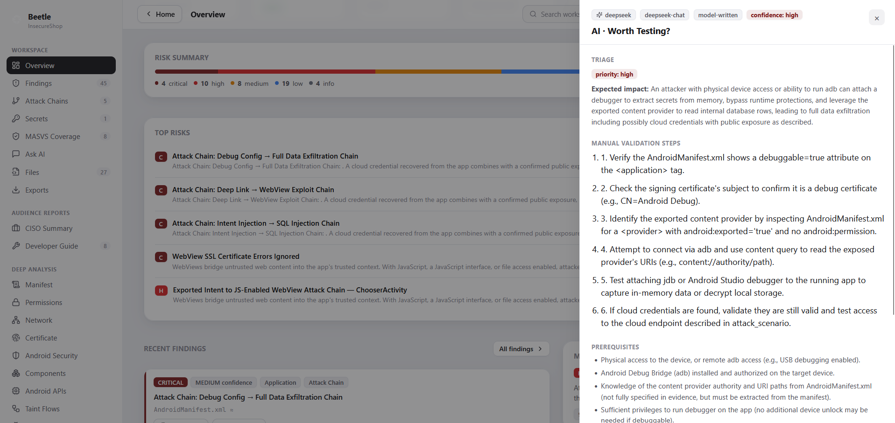

# 🪲 Beetle

# Attack-Chain Driven Mobile Application Security Platform

<p align="center">
  
</p>

<p align="center">

**Android • iOS • OWASP MASVS • AI-Assisted Analysis • Attack Chains • Source Navigation • SARIF • CycloneDX SBOM • Docker**

</p>

---

## Overview

**Beetle** is an offline-first mobile application security platform for analyzing Android APKs and iOS IPAs.

Designed for penetration testers, security engineers, developers, auditors, and mobile security researchers, Beetle combines static analysis, attack-chain generation, evidence-based findings, AI-assisted analysis, and professional reporting into a single analyst workspace.

Unlike traditional scanners that simply list vulnerabilities, Beetle correlates findings into realistic attack paths, links every issue directly to its source code, and provides actionable remediation guidance.

All analysis is performed locally on your infrastructure. Application binaries and source code are never uploaded to external services.

---

# Why Beetle?

Modern mobile applications can generate hundreds of security findings.

Beetle focuses on helping analysts answer three questions:

* **What is vulnerable?**
* **Why does it matter?**
* **How can an attacker combine these weaknesses?**

Instead of isolated findings, Beetle provides:

* Evidence-driven vulnerability analysis
* Attack Chain Intelligence
* Source-code navigation
* AI-assisted explanations
* MASVS-aligned findings
* Enterprise-ready reporting

---

# Features

## Android Static Analysis

* APK decompilation
* JADX integration
* apktool integration
* AndroidManifest analysis
* Smali analysis
* Resource analysis
* Native library inspection
* Permission analysis
* Secrets detection
* Certificate inspection
* Network Security Configuration analysis

---

## iOS Static Analysis

* IPA extraction
* Mach-O binary analysis
* Info.plist inspection
* Entitlements analysis
* Framework analysis
* Binary security checks
* Embedded configuration analysis

---

## Security Analysis

* OWASP MASVS Mapping
* Secrets Detection
* Hardcoded Credentials
* Cryptography Analysis
* Exported Components
* Certificate Analysis
* Network Security Review
* WebView Security
* Permission Risk Analysis
* Binary Hardening Checks

---

## Analyst Workspace

* Security Findings Dashboard
* Evidence-driven findings
* View Code
* Attack Chain Visualization
* Trust Score
* Security Score
* Rich code snippets
* Finding correlation
* Source navigation

---

## AI-Assisted Analysis

* Multiple AI Provider Support
* Offline deterministic analysis
* AI-assisted vulnerability explanations
* Attack path reasoning
* Remediation guidance
* Security recommendations

---

## Reports & Integrations

* Executive PDF Report
* Technical PDF Report
* Compliance Reports
* SARIF Export
* CycloneDX SBOM
* JSON Export

---

# Screenshots

## Home Dashboard


---

## Scan Overview


---

## Security Findings


---

## Permission Analysis


---

## Secrets Detection


---

## AI Security Assistant

Ask questions about findings, request remediation guidance, and understand attack scenarios.



---

## AI Provider Selection

Choose between multiple AI providers or use Beetle's deterministic offline analysis.



---

## AI Security Analysis

Receive contextual vulnerability explanations, attack path reasoning, and remediation guidance.



---

# Quick Start

## Clone the repository

```bash
git clone https://github.com/f3rb123/beetle.git

cd beetle
```

---

## Configure Beetle

Create a `.env` file (or export environment variables) with at least:

```env
SECRET_KEY=<minimum-32-character-secret>

CORTEX_ADMIN_PASS=<initial-admin-password>
```

Optional integrations:

```env
ANTHROPIC_API_KEY=...

VIRUSTOTAL_API_KEY=...
```

---

## Build the containers

```bash
docker compose build
```

---

## Start Beetle

```bash
docker compose up
```

The first startup may take several minutes while Docker builds and initializes the environment.

Watch the startup logs until Beetle reports that the backend has started successfully.

Then open:

```
http://localhost:9005
```

The initial administrator account is automatically created using the password specified in CORTEX_ADMIN_PASS. During the first startup, the generated administrator username and login information are also displayed in the container logs for convenience. 

Stop Beetle at any time with:

```
Ctrl + C
```

---

# Supported Formats

| Platform | Supported |
| -------- | --------- |
| Android  | APK       |
| iOS      | IPA       |

---

# Architecture

```
                React + Vite Frontend
                        │
                        ▼
                 FastAPI Backend API
                        │
                        ▼
         JADX / apktool / Native Analysis
                        │
                        ▼
           Static Analysis Engine
                        │
                        ▼
              Evidence Engine
                        │
                        ▼
          Attack Chain Generator
                        │
                        ▼
 PDF • SARIF • CycloneDX SBOM • JSON
```

Detailed documentation:

* ARCHITECTURE.md
* PROJECT_OVERVIEW.md
* FEATURE_INVENTORY.md

---

# Design Principles

* Offline-first architecture
* Evidence before assumptions
* Explainable findings
* Analyst-focused workflow
* Standards-based security analysis
* Docker-native deployment
* Extensible architecture

---

# Current Capabilities

* Android Static Analysis
* iOS Static Analysis
* Attack Chain Intelligence
* AI-Assisted Security Analysis
* MASVS Mapping
* Source Code Navigation
* Secrets Detection
* Binary Analysis
* Permission Analysis
* Trust Score
* Executive Reporting
* Compliance Reporting
* SARIF Export
* CycloneDX SBOM

---

# Roadmap

The following capabilities are planned for future releases:

* Native APKLeaks integration
* Advanced Binary Analysis
* Full Source Explorer
* Enterprise Collaboration Workspace
* CVE Intelligence
* CI/CD CLI
* GitHub Actions Integration
* Docker Hub Images
* Plugin SDK
* Enhanced iOS Analysis
* Team Workspaces
* API Integrations

---

# Contributing

Bug reports, feature requests, documentation improvements, and pull requests are welcome.

Please open an issue before submitting large feature changes so implementation can be discussed first.

---

# License

See the **LICENSE** file.

---

# Acknowledgements

Beetle builds upon and benefits from the open-source mobile security ecosystem, including projects such as:

* JADX
* apktool
* LIEF
* OWASP Mobile Application Security Verification Standard (MASVS)
* OWASP Mobile Security Testing Guide (MSTG)

Their work has significantly advanced mobile application security and made tools like Beetle possible.
