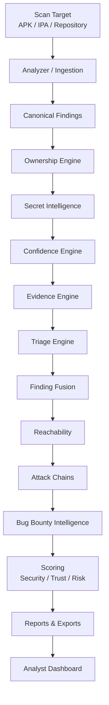

# 1. Introduction

## 1.1 What is Beetle?

**Beetle** is an offline-first mobile application security platform. It analyzes compiled
mobile applications — Android **APK** files and iOS **IPA** files — and source/CI-CD
**repository archives**, and turns them into a structured, evidence-backed, prioritized
security assessment.

Beetle is built for the people who have to *act* on mobile security findings:

- **Penetration testers** who need to know which findings are real, reachable and worth a
  proof-of-concept.
- **Security engineers** who need standards-mapped coverage (OWASP MASVS / Mobile Top 10)
  and reproducible evidence.
- **Developers** who need to see the exact file and line of an issue and a concrete fix.
- **Auditors and CISOs** who need defensible scores, compliance mapping, and an executive
  narrative.
- **Mobile security researchers** who want a fast, scriptable, local analysis workbench.

What distinguishes Beetle from a traditional scanner is its **second half**. A traditional
scanner ends at a flat list of pattern matches. Beetle treats that list as raw input to a
chain of **explainable intelligence engines** that answer the questions an analyst actually
asks:

- *Who owns this code?* (the app, a third-party SDK, a framework, generated code?)
- *Is this a real secret, or just a string that matches a regex?*
- *How confident are we, and why?*
- *Can an attacker actually reach this?*
- *Do several of these weaknesses combine into one realistic attack?*
- *Is this worth reporting?*

Every answer Beetle gives carries a human-readable reason. **Explainability is not a
feature; it is the architecture.**

> **All analysis is local.** Application binaries and source are processed on your own
> infrastructure. Beetle never uploads the artifact to an external service. A small number
> of *optional* enrichment integrations (VirusTotal hash lookups, OSV/CVE feeds, AI
> enrichment) make outbound calls and can be disabled — see Chapter 2 and Chapter 4.

> **A note on terms.** This chapter (and Chapter 2) use a few Beetle-specific terms before
> they are formally defined — most importantly **Canonical Finding** (the normalized finding
> object every engine annotates, defined in [Ch 2 §2.6](02-system-architecture.md)). Every
> bolded term is also defined in the [Glossary](25-glossary.md); you can read the Bible
> front-to-back without jumping, but the Glossary is there when a term is unfamiliar.

---

## 1.2 Goals

Beetle exists to solve three problems that make mobile security assessments slow and
unreliable:

1. **Noise.** A modern app can produce hundreds of raw findings, most of them in
   third-party SDKs and framework code the app team can't fix. Beetle classifies every
   finding's **ownership** and **triages** it, so application-owned, high-signal issues
   rise to the top and library noise is hidden-by-default (never deleted).

2. **Isolation.** Findings reported in isolation under-state risk. A debuggable flag, an
   exported component, and a SQL sink are each "medium" alone — together they are a
   critical, reachable attack. Beetle's **Attack Chain** engine correlates findings into
   realistic attacker journeys.

3. **Unverifiability.** "Trust me, it's vulnerable" doesn't survive a developer pushback.
   Beetle links every finding to its exact **source location**, captures a **renderable
   evidence** snippet, and records *how to reproduce it*. A finding you can't open in the
   source viewer is a finding Beetle is honest about.

The product north star: **maximize useful coverage while minimizing false positives and
duplicate detections**, and explain every conclusion.

---

## 1.3 Architecture overview

At the highest level, Beetle is a pipeline. *What* is analyzed (the **Scan Target**) is
cleanly separated from *how* it is analyzed (the shared intelligence pipeline). Every scan
target — Android, iOS, repository, and future targets — produces Canonical Findings that
flow through the **identical** downstream engines.

The full pipeline, every stage, and the deployment topology are documented in
[Chapter 2 — System Architecture](02-system-architecture.md). Each intelligence engine has
its own chapter in [Chapter 4](04-intelligence-engines.md) and the dedicated chapters that
follow.

The deployment is a two-container Docker Compose stack: an **nginx** frontend serving a
React single-page app, and a **FastAPI** Python backend that owns the scan queue, the
analyzers and a single SQLite database. The backend container is hardened
(`read_only`, `cap_drop: ALL`, tmpfs-only scratch space).

---

## 1.4 Supported platforms

Beetle ships as a Docker Compose application and runs anywhere Docker does (Linux, macOS,
Windows with WSL2). The user interface is a browser-based React workspace served on a
single port; no desktop client is required.

| Layer | Technology |
|-------|-----------|
| Frontend | React 18 SPA, Vite build, Tailwind CSS, served by nginx |
| Backend | Python 3.11, FastAPI / uvicorn |
| Datastore | SQLite (WAL mode), single file |
| Decompilation | JADX 1.5.0, apktool 2.9.3 (Android); native ZIP/Mach-O parsing (iOS) |
| Packaging | Docker Compose (two services) |

See [Chapter 2](02-system-architecture.md) for the full topology, resource limits, and
configuration.

---

## 1.5 Supported scan targets

A **Scan Target** is the unit of *what* Beetle ingests. Targets are registered in a single
registry (`backend/analyzers/scan_targets.py`); adding one is a single registry entry, with
no change to the upload endpoint, the job runner, or any intelligence engine.

| Target | Input | Platform tag | Decompile step | Status |
|--------|-------|--------------|----------------|--------|
| **Android APK** | `.apk` | `android` | Yes (JADX + apktool) | Shipping |
| **iOS IPA** | `.ipa` | `ios` | No (ZIP + Mach-O) | Shipping |
| **Repository / ZIP** | `.zip` | `cicd` | No | Shipping (CI/CD intelligence) |
| Infrastructure-as-Code | `.zip` | `iac` | — | Designed seam, not enabled |
| AI Project | `.zip` | `ai` | — | Designed seam, not enabled |

**Framework-built apps are first-class.** Flutter and React Native applications ship as
APKs or IPAs, so they use the same upload and auto-detection flow; Beetle detects the
framework and runs a dedicated sub-analyzer whose findings flow through the *same*
pipeline. See [Chapter 3 — Scan Targets](03-scan-targets.md) and
[Chapter 19 — Framework Intelligence](19-framework-intelligence.md).

---

## 1.6 Current capabilities

A capability summary; each item is documented in depth in its own chapter.

**Ingestion & static analysis**
- Android: APK decompilation (JADX + apktool), AndroidManifest analysis, Network Security
  Config parsing, certificate / signing-scheme analysis, smali/resource analysis, native
  `.so` (ELF) hardening checks.
- iOS: IPA extraction, Mach-O binary analysis, Info.plist & entitlements, embedded
  frameworks, data-storage / crypto / WebView analysis, instrumentation-dylib detection.
- Cross-platform: regex SAST (100+ rules) + Semgrep, secret detection (36+ patterns),
  taint analysis (Android), dependency CVE scanning (OSV + native version strings + CISA
  KEV), tracker/SDK detection, endpoint & IP discovery.

**Explainable intelligence engines** (Chapter 4)
- Ownership, Secret Intelligence, Confidence, Evidence, Triage, Finding Fusion,
  Reachability, Attack Chains v2, Bug Bounty reportability, Detection Coverage.

**Scoring & standards**
- Security Score (0–100, A–F grade), Trust Score, Risk Rating, per-finding Confidence,
  MASVS coverage, OWASP Mobile Top 10 mapping.

**Investigation workspace** (Chapter 5, 21)
- Findings triage, Attack Chain visualization, Secrets, Network, Permissions, Components,
  MASVS coverage, the Source Explorer + Security Explorer tree, Scan Compare.

**AI** (Chapter 22)
- Conversational AI Assistant over the evidence, one-shot AI finding actions
  (explain / verify / worth-testing / generate PoC / generate fix), provider-agnostic with
  a deterministic offline fallback.

**Reports & integrations** (Chapter 16, 23)
- Executive & technical PDF, compliance PDF (MASVS / PCI-DSS / OWASP), audience reports
  (CISO / Developer), SARIF 2.1.0, CycloneDX 1.5 SBOM, JSON; webhooks; CI/CD policy gate.

---

## 1.7 Design philosophy

Eight principles recur across every chapter. When in doubt about *why* Beetle behaves a
certain way, the answer is almost always one of these.

1. **Offline-first.** The artifact and its source never leave your infrastructure.
   Outbound enrichment is optional and clearly delineated.

2. **Evidence before assumptions.** A finding is only as valuable as the evidence behind
   it. Beetle prefers a finding it can pin to `file:line` with a renderable snippet over a
   confident-sounding finding it cannot prove. See [Chapter 13](13-evidence-engine.md).

3. **Explainable, never a black box.** Every score, every classification, every chain
   carries a `reason`. Bands and labels are for humans; the underlying breakdown is always
   retained and auditable.

4. **Additive, non-destructive intelligence.** Each engine *adds* metadata; none deletes,
   re-severities, or hides a finding outright. "Hidden by default" means *kept and
   collapsed until the analyst opts in* — nothing is ever silently dropped. This is what
   makes the pipeline safe to extend.

5. **Suppress for lack of value, never for being a library.** Noise reduction is driven by
   whether a finding has meaningful security value (ownership + evidence + reachability),
   not by a crude "it's in a third-party package" rule. A real, validated secret inside an
   SDK is still surfaced. See [Chapter 4 §Triage](04-intelligence-engines.md).

6. **Deterministic and versioned.** The intelligence engines are pure functions: same
   input → same output, no randomness, no network. Every engine stamps a version, so
   scores are comparable across releases and a golden-regression suite can detect drift.

7. **Data, not code, for extension.** New SDKs, secret patterns, chain templates, triage
   rules and detection sources are added as *data* in a config/registry file — not by
   editing engine logic. This keeps report noise flat as detection grows.

8. **One pipeline, many targets.** Ingestion differs per scan target; the intelligence
   pipeline is identical for all of them. A Flutter finding, an iOS finding and a CI/CD
   finding are all Canonical Findings and are scored, fused and reported the same way.

---

*Next: [Chapter 2 — System Architecture](02-system-architecture.md).*
