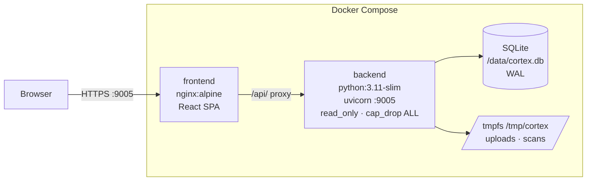
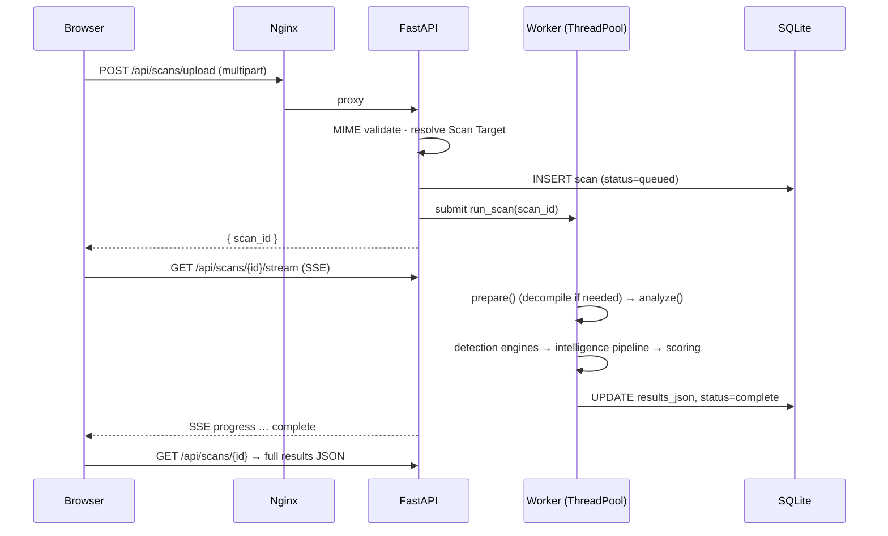
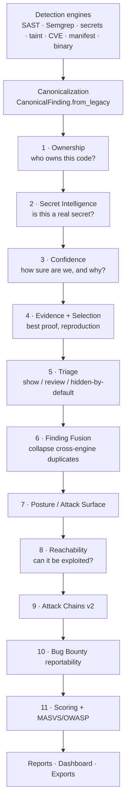
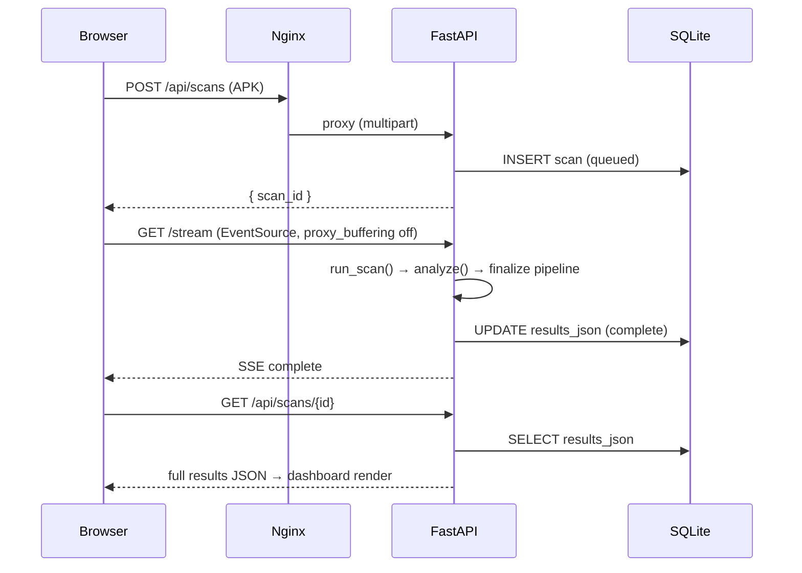

# 2. System Architecture

This chapter explains how Beetle is deployed, how a scan flows from upload to report, and
what each stage of the intelligence pipeline contributes. It is the map the rest of the
document hangs on.

---

## 2.0 Getting started — your first scan

If you have just deployed Beetle and want the shortest path from "running container" to
"reading results," this is it. (Deployment/build details are in the project `README`; the
configuration knobs are in [§2.12](#212-configuration-reference).)

```mermaid
sequenceDiagram
    participant You
    participant UI as Beetle UI (:9005)
    You->>UI: 1. Open http://localhost:9005
    You->>UI: 2. Log in (admin user; password from container logs / CORTEX_ADMIN_PASS)
    You->>UI: 3. Upload an .apk / .ipa / .zip
    UI-->>You: 4. Live progress (SSE)
    UI-->>You: 5. Scan complete → workspace opens
    You->>UI: 6. Overview → read the headline trio → drill into Findings & Attack Chains
```

1. **Open the UI.** Browse to `http://localhost:9005` (the nginx frontend; the backend is not
   exposed directly).
2. **Log in.** On first start Beetle seeds an **admin** account. If you set `CORTEX_ADMIN_PASS`
   that is the password; otherwise a random one is generated and **printed in the container
   logs** at startup. The username and password are both logged for reference.
3. **Upload an artifact.** Drag in an `.apk`, `.ipa`, or repository `.zip`. Beetle validates
   the file, resolves the **Scan Target** from its extension ([Ch 3](03-scan-targets.md)), and
   queues it (max 3 concurrent scans).
4. **Watch progress.** A live Server-Sent-Events stream shows human-readable steps. Large APKs
   can run longer than the 6-minute stream cap — they finish in the background and the UI falls
   back to polling ([§2.3](#23-the-scan-lifecycle)).
5. **Read results, top-down.** When the scan completes, the **workspace** opens on the
   **Overview**. Read the **headline trio** — Security Score, Trust Score, Risk Rating
   ([Ch 6 §6.3](06-scoring-systems.md)) — then start at the **Most Exploitable Chain** and the
   **Findings** view (filter to high-severity, high-confidence, application-owned). The full UI
   tour is [Chapter 5](05-dashboard-guide.md).

> **No artifact leaves your infrastructure.** Uploads live only in tmpfs and are removed after
> the scan; optional outbound enrichment (VirusTotal, OSV/CVE, AI, domain geo, live probing)
> is disableable ([§2.12](#212-configuration-reference)).

---

## 2.1 Deployment topology

Beetle is a two-container Docker Compose stack. The browser talks only to nginx; the
backend never exposes a port directly.



| Service | Image | Role | Limits / hardening |
|---------|-------|------|--------------------|
| `frontend` | `nginx:alpine` | Serves the React SPA, reverse-proxies `/api/` to the backend, terminates SSE. | mem 256 MB |
| `backend` | `python:3.11-slim` | FastAPI app: routes, scan queue, analyzers, reports. | mem 6 GB, 4 CPUs, `read_only=true`, `cap_drop: ALL`, `no-new-privileges`, tmpfs `/tmp` (2 GB) |

**Storage**

- `cortex-data` named volume → `/data/cortex.db` (the SQLite database, WAL mode) and
  `/data/reports/` (generated PDFs/SBOMs).
- tmpfs `/tmp/cortex/` (ephemeral) → uploaded artifacts and per-scan decompiled trees.
  Nothing about an uploaded artifact persists on disk past the scan TTL.

**Nginx** is configured for large APK uploads and the live progress stream:
`client_max_body_size 250M`, `proxy_read_timeout 600s`, and crucially
`proxy_buffering off` so Server-Sent Events stream through the proxy unbuffered.

---

## 2.2 The backend at a glance

`backend/main.py` is the single-file controller (~1,300 lines). It owns:

- **All FastAPI routes** (`/api/...`, no version prefix).
- **The scan queue** — a `ThreadPoolExecutor(max_workers=3)`. At most three scans run
  concurrently; the rest wait.
- **SSE streaming** — the live progress endpoint.
- **Scan-target resolution and report dispatch.**

| Route group | Purpose |
|-------------|---------|
| `/api/auth/*` | Login, token, user & API-key management |
| `/api/scans/*` | Upload, status/stream, results, file viewer, compare, reports |
| `/api/webhooks/*` | Webhook CRUD (admin) |
| `/api/rules/*` | Custom SAST rule CRUD (admin) |
| `/api/audit` | Audit log (admin) |
| `/api/health` | Unauthenticated health check |

**Authentication.** JWT (HS256, 24 h) issued on login against bcrypt password hashes, or
`X-API-Key: ck_…` keys (bcrypt-hashed in the DB). Two FastAPI dependencies enforce roles:
`get_current_user()` (any authenticated user) and `get_admin_user()` (admin only). The
frontend stores the JWT in `localStorage` and injects it via the `apiFetch()` wrapper,
which also handles 401-redirects and network-failure fallbacks.

**Database.** One SQLite file in WAL mode, no ORM. The entire output of a scan — every
finding, every enrichment, every score — is serialized into a single `results_json` blob
on the `scans` row. There is no normalized findings table; the JSON blob *is* the result.
Collaboration state (finding states, comments, assignment, suppression, sharing) lives in
`collaboration.py`, keyed by `app_id` so it survives re-scans.

> **Implication for analysts.** Because the whole result is one JSON document, the
> intelligence engines can annotate findings freely and the frontend can render any view
> from one fetch. It also means a scan result is a portable artifact.

---

## 2.3 The scan lifecycle



1. **Upload.** The file's MIME type is validated (`python-magic`), the **Scan Target** is
   resolved from the extension, a `scans` row is inserted (`status=queued`), and the job is
   submitted to the executor. The upload is stored only in tmpfs.

2. **Progress (SSE).** `GET /api/scans/{id}/stream` polls scan status every 400 ms, sends a
   5 s heartbeat, and emits human-readable progress steps. There is a 6-minute hard cap on
   the *stream* (not the scan): large APKs continue analyzing in the background after the
   stream closes, and the client falls back to polling `GET /api/scans/{id}`.

3. **Analysis.** The worker resolves the target, runs the (APK-only) decompile prepare
   step if `needs_decompile`, then calls the target's `analyze()` entry point. Detection
   engines populate `results["findings"]`, `results["secrets"]`, `results["endpoints"]`,
   `results["ips"]`, etc. The shared finalize pipeline (§2.5) then enriches everything.

4. **Persistence.** The result dict is serialized to `results_json`; status becomes
   `complete` (or `failed`). Webhooks fire asynchronously.

---

## 2.4 Scan-Target adapter layer

The upload endpoint and job runner are **target-agnostic**. `scan_targets.py` defines a
`ScanTarget` dataclass and a registry:

```python
ScanTarget("android",    "Android APK",      "android", (".apk",), True,  _android)
ScanTarget("ios",        "iOS IPA",          "ios",     (".ipa",), False, _ios)
ScanTarget("repository", "Repository / ZIP", "cicd",    (".zip",), False, _repository)
```

Each target owns *only* ingestion: which extensions select it, the `platform` tag
downstream surfaces read, whether the decompile prepare step runs, and a uniform
`analyze(file_path, scan_id, filename, artifacts)` entry point. `main.py` resolves the
target and drives `prepare()`/`analyze()` generically. This is what makes "one pipeline,
many targets" real — see [Chapter 3](03-scan-targets.md).

---

## 2.5 The intelligence pipeline (the core of Beetle)

After the detection engines emit raw findings, both the Android and iOS orchestrators (and
the repository analyzer) run the **same finalize pipeline**. Each stage is *additive* —
it writes new metadata onto findings and a scan-level summary, and is wrapped so a failure
never breaks the scan.



| Stage | Engine | Contribution | Chapter |
|------:|--------|--------------|---------|
| 1 | **Ownership** | `owner_type`, `owner_name`, `owner_confidence`, reason | [14](14-ownership-engine.md) |
| 2 | **Secret Intelligence** | per-secret `status`, validation, FP detection | [4](04-intelligence-engines.md) |
| 3 | **Confidence** | 5 explainable dimensions + `overall_confidence` | [10](10-finding-confidence.md) |
| 4 | **Evidence** | typed `evidence_bundle`, quality, verification, reproduction | [13](13-evidence-engine.md) |
| 5 | **Triage** | `decision` + `visibility` (noise reduction) | [4](04-intelligence-engines.md) |
| 6 | **Finding Fusion** | `detected_by`, `detection_count`, dedup across engines | [15](15-finding-fusion.md) |
| 7 | **Posture** | attack-surface inventory, exploitability score, attack graph | [4](04-intelligence-engines.md) |
| 8 | **Reachability** | `reachability` YES/MAYBE/NO + path + likelihood | [11](11-source-resolution.md), [12](12-attack-chains.md) |
| 9 | **Attack Chains v2** | correlated attacker journeys with evidence | [12](12-attack-chains.md) |
| 10 | **Bug Bounty** | reportability score/state, priority, next step | [4](04-intelligence-engines.md) |
| 11 | **Scoring** | Security Score, Trust Score, Risk, MASVS/OWASP | [6](06-scoring-systems.md)–[9](09-security-score.md), [17](17-masvs-coverage.md)–[18](18-owasp-coverage.md) |

> **Ordering matters.** Ownership runs first because almost every later engine reads
> `owner_type`. Secret Intelligence runs *before* secret masking (it needs raw values).
> Confidence runs after Fusion can supply multi-engine agreement. Reachability runs after
> the attack surface exists. The order is the dependency graph, not an accident.

---

## 2.6 The Canonical Finding

The unit that flows through the pipeline is the **Canonical Finding**
(`analyzers/canonical_finding.py`). Detection engines emit plain dicts; `from_legacy()`
normalizes them into a canonical model, the engines annotate it, and `to_fields()` /
`dict.update()` writes the metadata back onto the dict at the edge — so the rest of the
system keeps reading a familiar shape.

A canonical finding carries (non-exhaustive):

```
title, severity, category, description, recommendation
file_path, line, snippet, file_evidence[]      # location & raw evidence
cwe, masvs, owasp                              # standards mapping
detected_by[], detection_count, sources[]      # provenance (Fusion)
owner_type, owner_name, owner_confidence        # Ownership
overall_confidence, confidence_breakdown        # Confidence
evidence_bundle{...}                            # Evidence Engine
triage{decision, visibility, reason}            # Triage
reachability, reachability_path, likelihood     # Reachability
bug_bounty{reportability_score, state, ...}     # Bug Bounty
secret_intelligence{status, ...}                # for secret-bearing findings
```

Because every detection source produces this one shape, **adding a detection engine
requires no pipeline change** — the engine emits canonical findings, and Fusion + the rest
process them automatically.

---

## 2.7 Android ingestion pipeline

```
APK
├─ Extract ZIP  → apk_extract/
├─ Decompile (parallel): JADX → jadx/   ·   apktool → apktool/
├─ Core static analysis:
│   ├─ AndroidManifest (permissions, components, flags)
│   ├─ Network Security Config (cleartext, pins, user-CA)
│   ├─ Certificate / signing schemes (v1–v4, Janus, debug cert, key size)
│   ├─ Regex SAST (code_rules) + custom rules
│   ├─ String analysis (28 categories)
│   ├─ Evidence scanner (secrets, IPs, JWTs)
│   ├─ JS bundle analysis (RN/Cordova)  →  React Native sub-analyzer (if RN)
│   ├─ Flutter sub-analyzer (if Flutter)
│   └─ Framework / APKiD detection
├─ Binary analysis: ELF hardening (.so) · native-lib CVE mapping
├─ Third-party: trackers/SDKs · API usage · OSV dependency scan · Maven AARs
├─ Advanced: taint analysis (DEX call graph) · Semgrep · domain enrichment
├─ Live checks (optional, network): Firebase · S3 · AssetLinks · secret validation · VirusTotal
└─ FINALIZE: the shared intelligence pipeline (§2.5)
```

Decompilation is graceful: JADX timeout scales with APK size (~4 s/MB, capped), partial
output on timeout is kept and used, and very large APKs can skip JADX via `CORTEX_JADX_MAX_MB`.

---

## 2.8 iOS ingestion pipeline

```
IPA
├─ Extract ZIP → find Payload/*.app → ipa_extract/
├─ Core: Info.plist · entitlements · secrets · IPs · JWTs
│         data storage (Keychain/UserDefaults/CoreData/Realm/FileProtection)
│         crypto (CommonCrypto/CryptoKit/weak algos) · WebView (WK/UIWebView, JS bridges)
├─ Binary: Mach-O parse (PIE, NX, canary, ARC, FairPlay) · LIEF deep analysis
│          (instrumentation dylibs: Frida/Substrate/…) · ELF for any .so
├─ Third-party: embedded frameworks · CocoaPods CVE · OSV (Package.swift/Podfile.lock)
├─ Sub-analyzers: Flutter / React Native (if detected)
├─ Advanced: file inventory (.pem/.p12/.key/.realm) · iOS SAST rules · domain enrichment
├─ Live checks (same as Android)
└─ FINALIZE: the shared intelligence pipeline (§2.5)
```

The iOS and Android pipelines call the **same** finalize engines and produce
output with verified Android==iOS parity in the engine test suites.

---

## 2.9 Repository / CI-CD ingestion pipeline

A `.zip` repository archive is extracted (bounded to 20k files / 500 MB), the **CI/CD
Security Intelligence** engine (`cicd_intel.py`) walks the tree for pipeline/workflow
configs (GitHub Actions, GitLab CI, Azure DevOps, Jenkins, CircleCI, Bitbucket, Drone,
Buildkite, Tekton, generic YAML), and emits canonical findings — which then run the
**same** finalize engines (Fusion → Ownership → Confidence → Evidence → Triage → Attack
Chains → Scoring). The tree is persisted under the scan's `repo/` subdir so the Source
Explorer renders it. See [Chapter 3](03-scan-targets.md) and
[Chapter 4 §CI/CD](04-intelligence-engines.md).

---

## 2.10 Data flow: upload to report



---

## 2.11 File-system layout

```
/data/
  cortex.db            SQLite (WAL)
  reports/             generated PDF / SBOM
/tmp/cortex/           tmpfs (ephemeral, 2 GB)
  uploads/             uploaded APK/IPA/ZIP (removed after scan)
  scans/<scan_id>/
    jadx/              JADX decompiled Java
    apktool/           smali + resources
    apk_extract/       raw APK zip contents
    ipa_extract/       raw IPA contents
    repo/              extracted repository archive
```

The source-file resolver (`scan_storage.resolve_source_file()`) searches
`jadx/ → apktool/ → apk_extract/ → ipa_extract/ → repo/` in priority order, with a
basename-walk fallback for path-normalization differences across platforms. Scan
directories are cleaned up after `CORTEX_SCAN_TTL` (default 24 h). This resolver is the
backbone of **Source Resolution** ([Chapter 11](11-source-resolution.md)) and the
**Source Explorer** ([Chapter 21](21-source-explorer.md)).

---

## 2.12 Configuration reference

Set in the shell or `.env` before `docker compose up`.

| Variable | Required | Purpose |
|----------|:--------:|---------|
| `SECRET_KEY` | ✓ | JWT signing key (≥ 32 chars). |
| `CORTEX_ADMIN_PASS` | – | Initial admin password (auto-generated + logged if unset). |
| `ANTHROPIC_API_KEY` | – | AI enrichment / assistant (falls back to deterministic offline mode). |
| `VIRUSTOTAL_API_KEY` | – | VirusTotal hash lookups. |
| `CORTEX_DISABLE_LIVE_CHECKS` | – | `1` skips Firebase/S3/secret-probing and other network checks. |
| `CORTEX_ENABLE_CLOUD_INTELLIGENCE` | – | Opt-in cloud-exposure probing (off by default). |
| `CORTEX_JADX_HEAP` | – | JADX JVM max heap (keep below the 6 GB container limit). |
| `CORTEX_JADX_MAX_MB` | – | Skip JADX above this APK size. |
| `CORTEX_JADX_STATE_DIR` | – | Writable HOME/XDG base for JADX under `read_only` (default `/tmp/jadx`). |
| `CORTEX_SCAN_TTL` | – | Seconds before scan scratch dirs are cleaned (default 24 h). |

---

## 2.13 Platform self-security

Beetle analyzes untrusted binaries, so the platform itself is hardened.

| Control | Implementation |
|---------|----------------|
| Authentication | JWT HS256 + bcrypt passwords + bcrypt API keys |
| Authorization | Per-route role dependency (`get_admin_user`) |
| Container isolation | `read_only=true`, `cap_drop: ALL`, `no-new-privileges` |
| Upload isolation | tmpfs only, MIME validation |
| Webhook SSRF defense | DNS resolution + RFC-1918/loopback/link-local blocklist + DNS-rebinding re-check |
| Webhook integrity | HMAC-SHA256 signature (`X-Beetle-Signature`) |
| Audit trail | Privileged actions logged with user, IP, timestamp |
| Resource bounds | Backend 6 GB / 4 CPU; per-stage file/size/time caps throughout |

> **Known platform caveats** (tracked in the repo's tech-debt notes): JWTs live in
> `localStorage` (XSS-accessible); webhook secrets are stored plaintext in SQLite; Semgrep
> and LIEF are Python dependencies whose CLI/native availability in the shipped image
> should be confirmed for full coverage.

---

*Next: [Chapter 3 — Scan Targets](03-scan-targets.md).*
