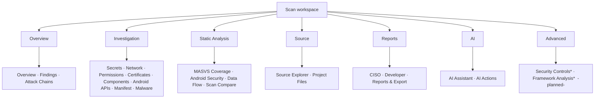
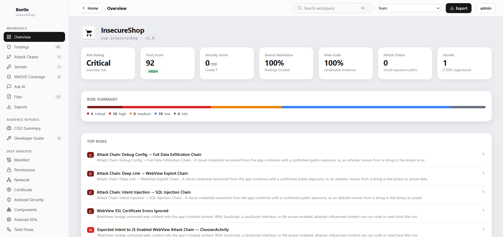
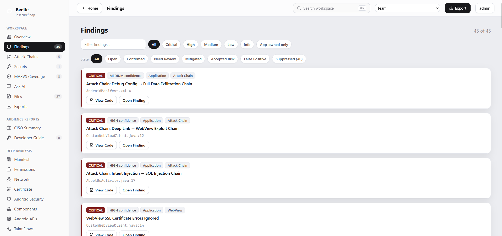
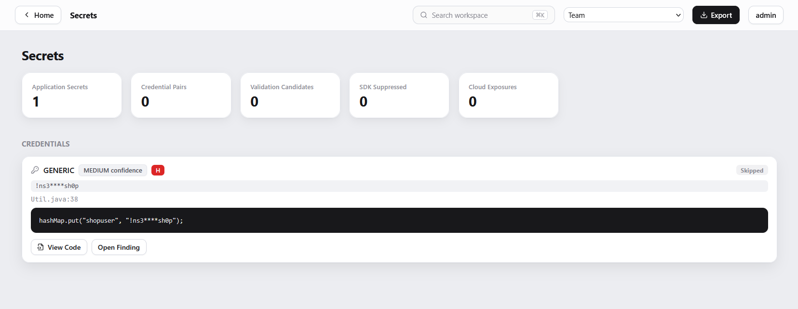
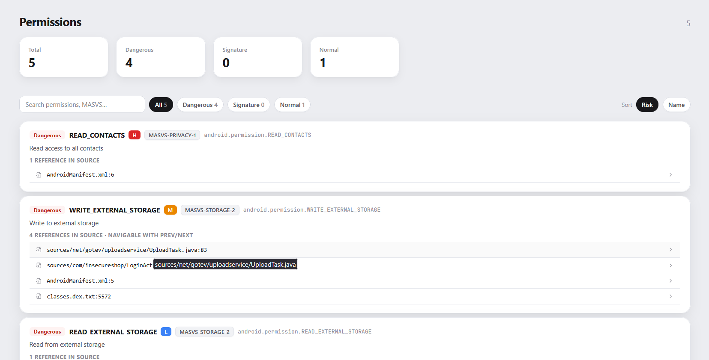

# 5. Dashboard Guide

The Beetle workspace is the analyst's investigation surface. This chapter documents the
navigation model and every screen, widget, card and statistic. Nothing in the workspace is
left unexplained.

> **Architecture note.** The active workspace is the "Explainable Security Workspace"
> (`workspace2/Workspace.jsx`). Its sidebar navigation *and* its section dispatch are both
> derived from one declarative panel registry (`workspace-registry.js`), so the navigation
> below is the literal, authoritative section list. (An older flat workspace exists in the
> codebase but is not rendered.)

---

## 5.1 Navigation model

The sidebar follows the **analyst workflow**, top to bottom, in seven groups:

```
Overview        → triage entry point
Investigation   → drill into concrete evidence
Static Analysis → derived posture & coverage
Source          → code exploration
Reports         → audience-specific output
AI              → assistance surfaces
Advanced        → roadmap surfaces (navigable placeholders)
```

| Group | Section | What it shows | Documented in |
|-------|---------|---------------|---------------|
| Overview | **Overview** | Scores, risk summary, top risks, recent findings, chains, MASVS posture | §5.3 |
| Overview | **Findings** | The full, filterable finding list | §5.4 |
| Overview | **Attack Chains** | Correlated attacker journeys | §5.5, [Ch 12](12-attack-chains.md) |
| Investigation | **Secrets** | Detected secrets + intelligence status | §5.6, [Ch 4](04-intelligence-engines.md) |
| Investigation | **Network** | URLs, deep links, IPs, domains | §5.7, [Ch 20](20-network-intelligence.md) |
| Investigation | **Permissions** | Declared permissions + risk | §5.8 |
| Investigation | **Certificates** | Signing scheme & cert analysis | §5.9 |
| Investigation | **Application Components** | Activities/Services/Receivers/Providers, exported surface | §5.10 |
| Investigation | **Android APIs** | Categorized platform-API usage | §5.11 |
| Investigation | **Manifest** | Parsed AndroidManifest / Info.plist | §5.12 |
| Investigation | **Malware Analysis** | VirusTotal + APKiD / instrumentation | §5.13 |
| Static Analysis | **MASVS Coverage** | Per-category coverage radar | §5.14, [Ch 17](17-masvs-coverage.md) |
| Static Analysis | **Android Security** | Platform-hardening posture | §5.15 |
| Static Analysis | **Data Flow Analysis** | Taint source→sink flows | §5.16, [Ch 4](04-intelligence-engines.md) |
| Static Analysis | **Scan Compare** | Diff two scans | §5.17 |
| Source | **Source Explorer** | File tree + code viewer + Security Explorer | §5.18, [Ch 21](21-source-explorer.md) |
| Source | **Project Files** | Flat file list | §5.18 |
| Reports | **CISO Summary** | Executive narrative | [Ch 23](23-audience-reports.md) |
| Reports | **Developer Report** | Fix-oriented report | [Ch 23](23-audience-reports.md) |
| Reports | **Reports & Export** | PDF / SARIF / SBOM / JSON | [Ch 16](16-reports.md) |
| AI | **AI Assistant** | Conversational analysis | [Ch 22](22-ai.md) |
| AI | **AI Actions** | One-shot finding actions | [Ch 22](22-ai.md) |
| Advanced | **Security Controls** | *Planned* controls posture board | §5.19 |
| Advanced | **Framework Analysis** | *Planned* Flutter/RN lenses | §5.19 |

Sidebar items show a **live count** where relevant (Findings, Attack Chains, Secrets, MASVS,
Project Files, Developer). Planned panels are real, navigable routes that open a "coming
soon" placeholder — proving the information architecture already accommodates them.



> **Platform note.** The section labels are Android-centric (Android Security, Android APIs,
> Manifest). On an **iOS** scan these sections render their iOS equivalents where applicable
> (e.g. Manifest shows the Info.plist) or fall back to an empty state; iOS-specific
> deep-analysis results (entitlements, embedded frameworks, data storage, cryptography,
> WebView/bridges) appear **inside the shared Findings / Manifest / Certificates / Binary
> surfaces**, not as dedicated iOS tabs — see [§5.21](#521-ios-scans-where-the-deep-analysis-appears).

*Insert screenshot of the workspace with the sidebar expanded here.*

---

## 5.2 The header band

Every workspace screen shares a top band identifying the scan: the app name / filename,
platform badge (Android / iOS / Flutter / React Native / CI-CD), package or bundle id,
version, file size and SHA-256, and the scan timestamp. This is the provenance of
everything below it.

---

## 5.3 Overview (the Dashboard)

The Overview is the triage entry point — the one screen that answers "how bad is this, and
where do I start?" It is composed of the following widgets.

### 5.3.1 The score band (Metric cards)

Four headline metric cards across the top:

| Card | Source | Meaning |
|------|--------|---------|
| **Risk Rating** | `ciso_summary.risk_rating` | Business-risk label (Critical/High/Medium/Low). See [Ch 7](07-risk-rating.md). |
| **Trust Score** | `trust_score.score` + `rating` | 0–100 — *can you trust these findings?* (report trustworthiness). See [Ch 8](08-trust-score.md). |
| **Security Score** | `score.score` /100 + `score.grade` | 0–100 + A–F grade — *how secure is the app?* See [Ch 9](09-security-score.md). |
| **Attack Chains** | `attack_chains` count | Number of correlated attack paths (incl. cloud exposure paths). See [Ch 12](12-attack-chains.md). |

> **Read these together, not in isolation.** A *low* Security Score with a *high* Trust
> Score means "the app is genuinely insecure and we're confident about it." A high Security
> Score with a low Trust Score means "few issues found, but coverage/evidence was weak —
> treat the clean result with caution." Chapter 8 and Chapter 24 (FAQ) walk through every
> combination.

### 5.3.2 Risk Summary

A severity breakdown of all visible findings — counts of Critical / High / Medium / Low /
Info, derived from `severity_summary`. This is the raw volume view; the scores above
contextualize it.

### 5.3.3 Top Risks

A curated shortlist (`analyst.top_risks`) of the highest-value findings — the issues Beetle
recommends an analyst look at first, each with a severity tag. When the analyst summary
hasn't produced an explicit top-risks list, the Overview falls back to the five
highest-severity findings.

### 5.3.4 Recent Findings

The most severe findings, each opening the **Finding Drawer** (§5.4.2) on click.

### 5.3.5 Attack Chains & Most Exploitable Chain

A compact list of detected attack chains plus a spotlight on the single **most exploitable
chain** (highest exploitability). Clicking opens the full Attack Chains view ([Ch 12](12-attack-chains.md)).

### 5.3.6 MASVS Posture

A small radar/score widget summarizing OWASP MASVS coverage (`masvs_summary.overall_score`
and per-category maturity). The full radar lives in the MASVS Coverage section ([Ch 17](17-masvs-coverage.md)).



---

## 5.4 Findings

The complete finding inventory.



### 5.4.1 Filters & controls

A rich control bar lets the analyst slice the list:

- **Severity** (Critical → Info)
- **Category** (WebView, Crypto, Storage, Network, …)
- **Detection source** (Beetle Native, Semgrep, APKLeaks, Flutter/RN Intelligence, …) — from
  Fusion's `detected_by`
- **Ownership** (Application / Third-party SDK / Framework / Generated) — from the Ownership
  engine
- **Framework** (native / Flutter / React Native)
- **"Trust ≥" slider** — filters by the per-finding **Trust** chip (the composite
  `0.6·confidence + 0.25·fusion + 0.15·evidence`, *not* raw confidence; see
  [Ch 6 §6.10](06-scoring-systems.md)). Use it to surface the strongest individual findings.
- **App Only toggle** — restrict to `Application`-owned findings (hides SDK/framework/generated).
- **State filter** — `open` / your triage states / **suppressed**. Choosing *suppressed*
  switches the list to the suppressed set (see below).
- **Free-text search** — matches title, category, path, CWE and detection source.

The default view applies **Triage visibility** — `HiddenByDefault` findings (framework/SDK
noise, generated code, documentation examples) are collapsed, never deleted. The **suppressed
view** (and the analyst's own *suppressed* state) reveals them on demand. This is how Beetle
reduces noise without losing data ([Ch 4 §Triage](04-intelligence-engines.md)). Suppression,
state, comments and assignment are collaboration state, persisted per `app_id` across re-scans
(§5.20).

### 5.4.2 The finding card & Finding Drawer

Each finding renders as a card whose header carries the intelligence chips that make Beetle's
findings explainable. The chips shown (when the data is present) are exactly:

- **Severity** (reachability-adjusted; `severity_original` preserved)
- **Confidence** — HIGH / MEDIUM / LOW, the engine's per-finding reliability ([Ch 10](10-finding-confidence.md))
- **Trust** — the 0–100 at-a-glance composite chip ([Ch 6 §6.10](06-scoring-systems.md)) — *a
  different number from both Confidence and the report Trust Score*
- **Evidence** — the evidence score for the selected proof ([Ch 13](13-evidence-engine.md))
- **Fusion** — the corroboration score, when multiple engines agreed ([Ch 15](15-finding-fusion.md))
- **Ownership** — Application / SDK / Framework / Generated ([Ch 14](14-ownership-engine.md))
- **Reachability** — YES / MAYBE / NO ([Ch 4 §4.20](04-intelligence-engines.md))
- **Attack Chain** — "In chain", when the finding participates in a chain ([Ch 12](12-attack-chains.md))

Opening a finding reveals the **Finding Drawer**: full description, the rendered evidence
snippet with **View Code** (jumps to the exact line in the Source Explorer), reachability
path, the analyst explanation (why it matters / attack scenario / how to verify / how to
fix), CWE/MASVS/OWASP standards, the confidence breakdown, and the **AI actions** row
(explain / verify / worth testing / generate PoC / generate fix → opens the AI Assistant
with the finding loaded). Evidence and View Code are covered in [Chapter 11](11-source-resolution.md).

---

## 5.5 Attack Chains

Lists every correlated attack chain (`attack_chains_v2`), each with a severity tag, title,
the ordered narrative (entry point → required steps → goal), participating findings,
blocking mitigations, exploitability/confidence, and per-step evidence references. Full
treatment in [Chapter 12](12-attack-chains.md).

---

## 5.6 Secrets

Each detected secret with its **Secret Intelligence status** badge (Validated / Probable /
Possible / False Positive / Documentation Example / Public Value / Generated Constant), a
masked value, provider, owner, context score, confidence and source `file:line`. Validated
secrets are highlighted. See [Chapter 4 §4.6](04-intelligence-engines.md).



---

## 5.7 Network

Two areas: **URLs / endpoints / deep links / domains** and **IP addresses**. IPs render with
classification (Public/Private/Loopback/…), owner (color-coded), confidence %, source
`file:line`, occurrence count and intelligence tags. Full chapter:
[Chapter 20](20-network-intelligence.md).

---

## 5.8 Permissions

Declared permissions grouped by risk (dangerous / signature / normal), each with its purpose
and any associated finding (e.g. a dangerous permission feeding a permission-data-leak
chain). Permission risk feeds the Security Score and attack-surface posture.



---

## 5.9 Certificates

The APK signing analysis: detected signing schemes (v1/v2/v3/v4), Janus risk
(CVE-2017-13156 for v1-only), debug-certificate detection, SHA-1 signature flagging,
expiry, RSA key size, and both SHA-1 and SHA-256 fingerprints. For iOS, code-signature and
entitlement data.

---

## 5.10 Application Components

The component inventory — Activities, Services, Broadcast Receivers, Content Providers —
with their **exported** status, intent filters, deep links and permission guards. The
**exported-component inventory** and **high-risk components** (from the Posture analyzer)
drive the attack-surface score and several attack-chain templates.

---

## 5.11 Android APIs

Platform-API usage categorized (35 categories: crypto, networking, telephony, location,
reflection, dynamic loading, …) from `api_analyzer`, plus extracted emails and APKiD
features. Informational context for the analyst, and a signal for several detectors.

---

## 5.12 Manifest

The parsed AndroidManifest.xml (or iOS Info.plist): SDK levels, declared components,
permissions, flags (`debuggable`, `allowBackup`, `usesCleartextTraffic`), and the Network
Security Config reference. Findings that originate here link back to the manifest entry via
the Evidence engine's manifest correlation.

---

## 5.13 Malware Analysis

VirusTotal verdict (when `VIRUSTOTAL_API_KEY` is configured) for the main file + up to five
DEX hashes — malicious / suspicious / clean, with the threat-family name; plus APKiD
packer/obfuscator detection and (iOS) instrumentation-dylib detection from LIEF.

---

## 5.14 MASVS Coverage

A radar chart of the eight OWASP MASVS v2 categories with per-category score and maturity
(weak / moderate / strong), an overall score, and the positive control signals detected
(certificate pinning, Keystore/Keychain, encrypted storage, root/tamper detection, …). Full
chapter: [Chapter 17](17-masvs-coverage.md).

---

## 5.15 Android Security

A platform-hardening posture view: debuggable/backup flags, cleartext traffic, exported
surface, binary hardening summary, and the security factors that feed the Security Score
([Ch 9](09-security-score.md)).

---

## 5.16 Data Flow Analysis

The taint flows: each source → sink path with the full call chain and severity. Android
only. See [Chapter 4 §4.5](04-intelligence-engines.md).

---

## 5.17 Scan Compare

Diffs two scans of the same app (by `app_id`): findings added, removed and unchanged, score
deltas, and regression detection. Useful for verifying a fix landed and didn't introduce new
issues, and for release-over-release trend.

---

## 5.18 Source / Project Files

**Source Explorer** is the file tree + code viewer + Security Explorer; **Project Files** is
a flat file listing. Both are covered in depth in [Chapter 21](21-source-explorer.md).

---

## 5.19 Advanced (planned)

Two navigable roadmap placeholders:

- **Security Controls** — a controls posture board (crypto / network / storage / platform)
  rolled up from coverage + findings.
- **Framework Analysis** — Flutter / React Native specific lenses (bundle, native libs,
  framework secrets).

These render a "coming soon" panel today; shipping one flips its registry `status` to
`ready` and registers a renderer — no shell refactor.

---

## 5.20 Cross-cutting UI behaviors

- **Finding → source jump.** Every finding row, evidence card and chain step exposes
  *View Code* / *View Smali*, which opens the Source Explorer at the exact file and line and
  highlights the snippet ([Ch 11](11-source-resolution.md), [Ch 21](21-source-explorer.md)).
- **Severity normalization.** The frontend normalizes backend severity casing so the UI is
  consistent regardless of detector output.
- **Empty-safe.** Every section degrades gracefully when its data is absent (e.g. taint on
  iOS, certificates on a repository scan).
- **Collaboration.** Finding state, comments, assignment, suppression and sharing
  (`collaboration.py`) are keyed by `app_id`, so they persist across re-scans of the same
  app.

---

## 5.21 iOS scans: where the deep-analysis appears

A first-time iOS user often looks for dedicated **Entitlements**, **Frameworks**, **Data
Storage**, **Cryptography** or **WebView/Bridges** tabs. The current ("Explainable Security
Workspace") navigation **does not have separate iOS panels** — those were sections in an
earlier, retired workspace. iOS deep-analysis results are still produced and surfaced; they
just live inside the shared sections:

| iOS analysis | Where it appears now |
|--------------|----------------------|
| Mach-O hardening (PIE/NX/canary/ARC/FairPlay), instrumentation dylibs | **Malware Analysis** + **Findings** (Binary category) |
| Entitlements, code signature | **Certificates** + **Findings** |
| Info.plist, capabilities, SDK versions | **Manifest** + the header band |
| Data storage (Keychain/UserDefaults/CoreData/Realm) | **Findings** (Insecure Storage category) + Source Explorer |
| Cryptography (CommonCrypto/CryptoKit/weak algos) | **Findings** (MASVS-CRYPTO) |
| WebView / JS bridges | **Findings** (WebView category) |
| Embedded frameworks, CocoaPods CVEs | **Findings** + the SBOM export |

So on iOS, drive everything from **Findings** (filter by category) and the **Source
Explorer**; the Android-named sections (Android Security, Android APIs, Data Flow) show empty
states because their analyses are Android-specific (e.g. taint is Android-only). See
[Ch 19 §19.3](19-framework-intelligence.md). *(A dedicated "Framework Analysis" lens is on the
roadmap — §5.19.)*

---

*Next: [Chapter 6 — Scoring Systems](06-scoring-systems.md).*
