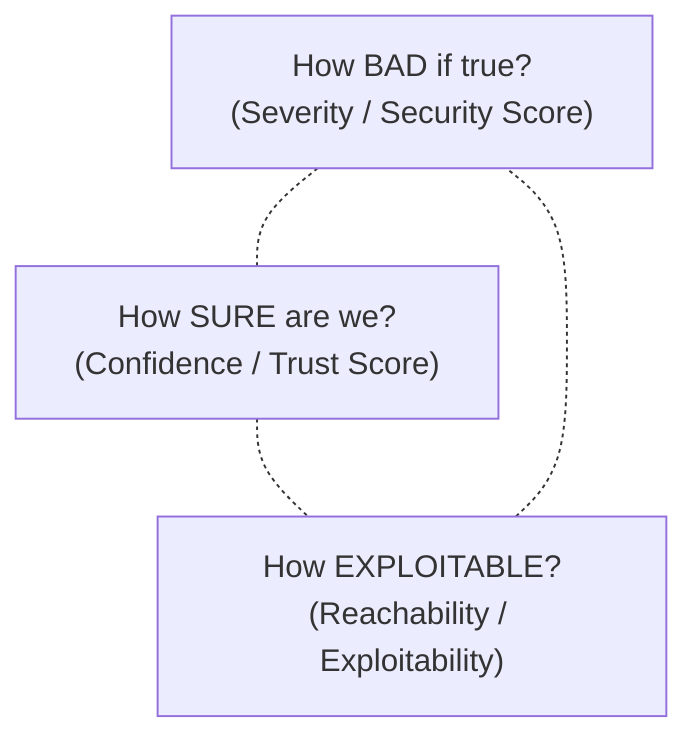
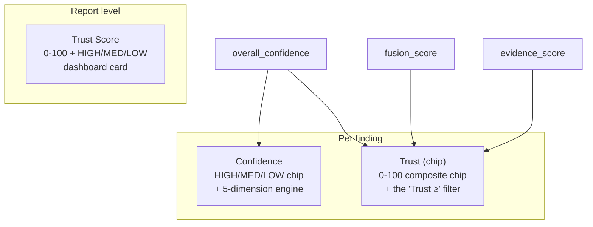

# 6. Scoring Systems

Beetle produces several numbers, and analysts routinely confuse them. This chapter is the
master reference: it explains *what each score measures*, *why each exists*, and crucially
*how they differ*. Each score then has its own deep-dive chapter.

The cardinal rule:

> **No single number tells the whole story. Beetle deliberately separates "how secure is the
> app" from "how confident are we" from "how exploitable is it" from "how reportable is it."
> Collapsing them into one number would destroy the information that makes a finding
> actionable.**

---

## 6.1 The score family at a glance

| Score | Scale | Answers | Direction | Engine | Chapter |
|-------|-------|---------|-----------|--------|---------|
| **Security Score** | 0–100 + A–F grade | *How secure is this app?* | higher = safer | `scoring.py` | [9](09-security-score.md) |
| **Risk Rating** | Critical→Info label | *What is the business risk?* | — | `posture` / CISO | [7](07-risk-rating.md) |
| **Trust Score** | 0–100 (HIGH/MED/LOW) | *Can I trust these findings?* | higher = more trustworthy | `trust_engine.py` | [8](08-trust-score.md) |
| **Finding Confidence** | 0–100 per finding | *How sure are we about this one finding?* | higher = surer | `confidence/` | [10](10-finding-confidence.md) |
| **Trust (per-finding chip)** | 0–100 per finding | *Quick rank of one finding's reliability* | higher = stronger | frontend composite | §6.10 |
| **Severity** | Critical→Info per finding | *How bad if true?* | — | detectors + reachability | [7](07-risk-rating.md) |
| **Exploitability** | 0–100 | *How exploitable overall?* | higher = more exploitable | `posture_analyzer.py` | [12](12-attack-chains.md) |
| **Reportability** | 0–100 (P1–P4) | *Worth reporting?* | higher = more valuable | `bug_bounty/` | [4](04-intelligence-engines.md) |
| **Fusion score** | 0–100 per finding | *How corroborated across engines?* | higher = more agreement | `fusion/` | [15](15-finding-fusion.md) |
| **MASVS coverage** | 0–100 per category | *How much MASVS is implemented?* | higher = more mature | `masvs_intel.py` | [17](17-masvs-coverage.md) |
| **Source Resolution %** | 0–100% | *How many findings resolve to source?* | higher = better evidence | `finding_model` | [11](11-source-resolution.md) |

The three you see first on the dashboard — **Security Score**, **Trust Score**, **Risk
Rating** — are the headline trio (§6.3).

> **Heads-up on naming.** "Trust Score" (the report card), "Trust" (a per-finding chip), and
> "Confidence" (a per-finding score) sound alike but are three different numbers. If you only
> read one thing in this chapter, read **§6.10**, which disambiguates them.

---

## 6.2 Why so many scores? Three orthogonal axes

A finding (and an app) lives in a three-dimensional space, and these axes are independent:

- A **critical** vulnerability we are **unsure** of and that is **unreachable** is not the
  same as a **medium** issue we have **proven** and that is **externally reachable**. A
  single blended number cannot express that difference; Beetle's separate scores can.
- This is why **Confidence is never severity**, **Exploitability is never severity**, and
  **Trust Score deliberately excludes reachability** (it answers trustworthiness, not
  exploitability).

Keeping the axes separate is what lets the analyst ask precise questions: *"show me
high-severity, high-confidence, reachable, application-owned findings"* — which is exactly
the Findings filter bar ([Ch 5 §5.4](05-dashboard-guide.md)).

---

## 6.3 The headline trio and how to read them together

The Overview dashboard shows Risk Rating, Trust Score and Security Score side by side
([Ch 5 §5.3](05-dashboard-guide.md)). Read them as a matrix:

| Security Score | Trust Score | Interpretation |
|----------------|-------------|----------------|
| Low | High | The app is genuinely insecure and the evidence is strong. **Act on it.** |
| Low | Low | Many findings, but weak evidence/coverage (e.g. heavy obfuscation). **Investigate before reporting.** |
| High | High | Few issues found and we're confident in that result. **Strongest "clean" signal.** |
| High | Low | Few issues found, but coverage/evidence was poor. **A clean result you should not fully trust.** |

> The most dangerous quadrant is **High Security Score / Low Trust Score** — a falsely
> reassuring "clean" report. Beetle surfaces Trust Score precisely so this case is visible
> rather than hidden.

---

## 6.4 Common scoring principles

Every Beetle score obeys the same design rules:

1. **Explainable.** Each score carries a `reason` / `breakdown` / `factors` object. Bands
   ("HIGH", "Grade B") are labels for humans; the underlying components are always retained.
   You can always see *why* a number is what it is.

2. **No magic numbers.** Every weight and threshold lives in a documented config and is
   justified. Tuning a model means editing one file and bumping its version.

3. **Deterministic & versioned.** Same input → same score, always. Each engine stamps a
   version so scores are comparable across releases and drift is detectable.

4. **Severity is an input, not the master.** Several scores deliberately *exclude* severity
   (Confidence, Reportability) so a low-severity, high-value application finding is not
   buried under a critical-but-irrelevant framework finding.

5. **Diminishing returns.** Volume-based scores cap the contribution of repeated findings of
   the same kind, so one pathological category can't dominate (see Security Score, §6.5).

---

## 6.5 How the Security Score is actually computed (summary)

Full detail in [Chapter 9](09-security-score.md); the essentials:

- Start at **100**.
- **Severity deductions** using weights `critical 15 · high 8 · medium 3 · low 1 · info 0`,
  with **diminishing returns** — each severity class is capped at `3 × weight` total, so 20
  mediums cost the same as 3 mediums. The same model applies to secrets.
- **Correlated-risk penalty** — attack chains cost an extra 5 each (cap 20) and a high
  overall exploitability adds up to 10 more, because *a reachable chain is worse than the sum
  of its individually-counted findings*.
- **Bonuses** for positive controls (certificate pinning +5, root detection +3, SafetyNet/
  Play Integrity +3, SQLCipher +3, obfuscation +3, FLAG_SECURE +2, Frida detection +2).
- Clamp to **[0, 100]**, round, map to a grade: **A ≥ 90 · B ≥ 75 · C ≥ 60 · D ≥ 40 · F < 40**.
- A descriptive **factor breakdown** (attack chains, SSL, exported components, secrets,
  WebView, certificates, cleartext, exploitability) is attached for the UI — descriptive
  only, so it never double-counts against the deductions.

---

## 6.6 How the Trust Score is computed (summary)

Full detail in [Chapter 8](08-trust-score.md); the weighted factors:

| Factor | Weight | Source |
|--------|:------:|--------|
| Evidence quality | 35% | per-finding `evidence_quality` (HIGH/MED/LOW) |
| Source resolution | 30% | share of findings resolved to a source `file:line` |
| Ownership certainty | 20% | share of findings with a known owner |
| Chain confidence | 15% | attack-chain `chain_confidence` |

Ratings: **HIGH ≥ 75 · MEDIUM 50–74 · LOW < 50**. Reachability is intentionally **not** a
factor.

---

## 6.7 How Finding Confidence is computed (summary)

Full detail in [Chapter 10](10-finding-confidence.md). Five independent dimensions —
detection, ownership, evidence, context, exploitability — combine as
`0.30·detection + 0.20·ownership + 0.25·evidence + 0.15·context + 0.10·exploitability`, with
short-circuits (validated secret → ≥95, chain member → ≥85, unresolved evidence → ≤35).
Bands: High ≥ 75 · Medium ≥ 50 · Low ≥ 25 · Informational < 25.

---

## 6.8 Edge cases & how Beetle handles them

| Situation | Effect | Why |
|-----------|--------|-----|
| Heavy obfuscation (ProGuard/R8) | Ownership "Unknown" rises → **Trust Score drops**; Security Score unaffected | We can't attribute owners, so we're honest that confidence is lower — but the source still resolves. |
| Hundreds of the same medium | Security Score barely moves past the cap | Diminishing returns prevent one noisy category from tanking the grade. |
| One validated live secret | That finding's Confidence floors at 95; Security Score takes a critical-class hit | Deterministic proof overrides heuristics. |
| Findings only in third-party SDKs | Triaged hidden-by-default; **Trust Score's ownership factor still counts them as "known owner"** | Known-SDK ownership is *certainty*, even if the finding is noise. |
| Repository (CI/CD) scan | No certificate/permission scores; Security Score from CI findings + chains | Scores degrade gracefully per scan target. |
| Zero findings | Security Score 100 / Grade A, but check Trust Score | A clean result is only as good as the coverage behind it (§6.3). |

---

## 6.9 Putting it together: a worked reading

> *DVBA (Damn Vulnerable Banking App), Android.* Security Score **F (low)** — many real,
> high-severity issues. Trust Score **~44 (LOW)** — not because the findings are wrong, but
> because the app is heavily obfuscated, so ~56% of findings have "Unknown" ownership even
> though 100% resolve to source. Reading the trio: *the app is badly insecure (low Security
> Score), the issues are real and resolve to source (100% source resolution), but owner
> attribution is uncertain (low Trust Score driven by obfuscation)* — exactly the nuance a
> single number would erase. (Source-resolution figures: [Ch 11](11-source-resolution.md).)

---

## 6.10 Three numbers named "trust" / "confidence" (read this to avoid confusion)

This is the single most common point of confusion for a new Beetle user, so it gets its own
section. There are **three distinct numbers** that all sound alike, computed differently, and
shown in different places. They are *not* interchangeable.

| Name | Scope | What it is | Formula | Where you see it | Chapter |
|------|-------|------------|---------|------------------|---------|
| **Trust Score** | the whole scan | Report trustworthiness — *can I believe this report?* | `0.35·evidence + 0.30·source-resolution + 0.20·ownership + 0.15·chain-confidence` | Overview **Trust Score** card | [8](08-trust-score.md) |
| **Confidence** | one finding | How sure Beetle is the finding is real — *5 independent dimensions* | `0.30·detection + 0.20·ownership + 0.25·evidence + 0.15·context + 0.10·exploitability` | Finding card **Confidence** chip (HIGH/MED/LOW) + the confidence breakdown | [10](10-finding-confidence.md) |
| **Trust (per-finding chip)** | one finding | A frontend "at-a-glance" composite of the finding's own signals | `0.6·overall_confidence + 0.25·fusion_score + 0.15·evidence_score` (band: ≥75 high · ≥50 med · ≥25 low) | Finding card **Trust** chip + the **"Trust ≥" filter** in the Findings view | this section |

### How to keep them straight

- The **Trust Score card** on the dashboard is about the *report* (driven mostly by evidence
  and source resolution). Use it with the Security Score ([§6.3](#63-the-headline-trio-and-how-to-read-them-together)).
- The **per-finding Trust chip** (and the **"Trust ≥" slider**) ranks *individual findings* by
  combining their confidence, multi-engine corroboration and evidence into one glance number.
  It is the right control for "show me the strongest individual findings."
- The **Confidence chip / engine** is the explainable, dimension-by-dimension *why* behind a
  single finding's reliability. Open it when a number surprises you.

> **Rule of thumb:** *Trust Score (card) = trust the report. Trust (chip) = rank a finding at
> a glance. Confidence = explain a finding in depth.* The report-level Trust Score and the
> per-finding Trust chip share a name but are different formulas over different inputs.

---

*Next: [Chapter 7 — Risk Rating](07-risk-rating.md).*
