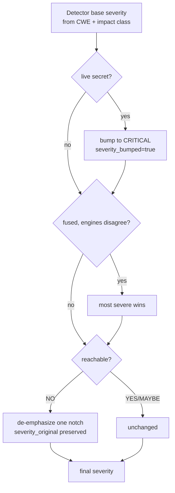

# 7. Risk Rating

Risk Rating and Severity are the labels Beetle uses to express *how bad* an issue is. This
chapter defines each level, explains how Beetle assigns them, and relates them to the
industry standards (CVSS, OWASP, MASVS) analysts already know.

---

## 7.1 Severity vs Risk Rating

Two related but distinct concepts:

- **Severity** is a *per-finding* label: Critical / High / Medium / Low / Informational. It
  expresses the technical impact of one issue if it is real.
- **Risk Rating** is an *app-level* label shown on the dashboard and the CISO summary
  (`ciso_summary.risk_rating`). It expresses the overall business risk of the application,
  derived from the worst reachable findings and the attack-chain picture.

The app-level Risk Rating tracks the highest *meaningful* severity present: if any reachable
critical exists, the app is Critical; if the worst is a reachable high, it is High; and so
on down to Minimal when nothing of substance is found.

---

## 7.2 The five levels

### Critical
Direct, high-impact compromise with low attacker effort — e.g. a **validated live secret**,
remote code execution via a WebView JS bridge, SQL injection reachable from an exported
component, or a confirmed open Firebase database. Critical findings typically anchor an
attack chain and demand immediate remediation.

> *Examples:* `AKIA…` AWS key confirmed live by the secret validator; `addJavascriptInterface`
> on a WebView loading attacker-influenceable content; an exported `ContentProvider` with a
> path-traversal file read.

### High
Serious weakness that is exploitable under realistic conditions, or a critical-class issue
whose reachability is not fully proven — e.g. disabled TLS validation
(`badCertificateCallback => true`, `rejectUnauthorized:false`), cleartext traffic carrying
tokens, a debug certificate on a release build, weak RSA key size, a hardcoded (unvalidated)
credential in application code.

### Medium
Real issue that requires specific conditions, user interaction, or local access — e.g.
insecure data storage (plaintext SharedPreferences/AsyncStorage), missing certificate
pinning, a per-domain cleartext exception, an over-broad but not directly dangerous
permission, weak cryptography in a non-sensitive path.

### Low
Minor hygiene or hardening gap with limited direct impact — e.g. a missing backup pin,
verbose logging, a non-sensitive informational leak, partial RELRO on a native library.

### Informational
Not a vulnerability — context an analyst should know: detected trackers/SDKs, recon-only
configuration identifiers (e.g. an AWS Cognito *User Pool* id), public keys/certificates,
documented framework behavior. Informational items carry zero Security-Score weight but are
retained for completeness.

| Level | Attacker effort | Typical impact | Security-Score weight |
|-------|-----------------|----------------|:---------------------:|
| Critical | Low | Full/again-sensitive compromise | 15 |
| High | Low–Medium | Serious data/security impact | 8 |
| Medium | Medium / conditional | Conditional compromise | 3 |
| Low | High / limited | Hardening gap | 1 |
| Informational | — | Context only | 0 |

---

## 7.3 How Beetle assigns severity

Severity comes from several places and is then *refined* by the intelligence pipeline:

1. **Detector-assigned base severity.** Each SAST/Semgrep/secret/manifest/binary rule ships
   a base severity grounded in its CWE and impact class.

2. **Live-validation bumps.** A secret confirmed live by the secret validator is bumped to
   **critical** (`severity_bumped=True`) — deterministic proof overrides the heuristic base.

3. **Fusion conflict resolution.** When multiple engines disagree on a fused finding's
   severity, **the most severe wins** — tools under-rate as often as they over-rate, so
   Beetle trusts the worst case ([Ch 15](15-finding-fusion.md)).

4. **Reachability adjustment.** The Reachability engine can *de-emphasize* a finding by one
   notch when it is unreachable (an unexploitable setting), preserving `severity_original`.
   This is the only stage that lowers severity, and it never raises it.

> **Chains never re-severity findings.** An attack chain has its own chain-level severity
> (goal-based, downgraded if blocked or low-exploitability); it does **not** change the
> severity of its member findings ([Ch 12](12-attack-chains.md)).

---

## 7.4 Relationship to CVSS

Beetle does not compute a CVSS vector for every mobile finding — CVSS is calibrated for
networked vulnerabilities and maps awkwardly onto static mobile findings (many mobile issues
depend on device access, user interaction, or app-specific entry points that CVSS base
metrics don't capture well). Instead Beetle's severity is **impact + reachability driven**,
which aligns with CVSS intuition:

- A Beetle **Critical** corresponds to roughly CVSS 9.0–10.0 (high impact, low complexity,
  reachable).
- **High** ≈ 7.0–8.9, **Medium** ≈ 4.0–6.9, **Low** ≈ 0.1–3.9, **Informational** ≈ 0.0.

Where a finding *is* a CVE in a bundled component, the **actual CVE/CVSS** is surfaced
directly from OSV.dev, and **CISA KEV** membership bumps it to High regardless of base score
([Ch 4 §4.9](04-intelligence-engines.md)). So for dependency findings you get real CVSS;
for code/config findings you get Beetle's reachability-aware severity.

---

## 7.5 Relationship to OWASP

Every code/config finding carries an **OWASP Mobile Top 10** mapping (and frequently a
classic OWASP Top 10 / CWE pairing). Severity and the OWASP category are independent axes:
the OWASP category says *what class of weakness* it is (e.g. M3: Insecure Communication),
the severity says *how bad this instance is*. The mapping is documented per-rule and rolled
up in [Chapter 18 — OWASP Coverage](18-owasp-coverage.md).

---

## 7.6 Relationship to MASVS

OWASP **MASVS** is a *requirements/maturity* standard, not a severity scale. Beetle maps
findings to MASVS categories for **coverage** (how much of the standard is implemented —
[Ch 17](17-masvs-coverage.md)), while severity expresses the impact of the specific gap. A
single MASVS category (e.g. MASVS-CRYPTO) can contain findings of several severities; the
category's *maturity* (weak/moderate/strong) is a separate, posture-level signal.

---

## 7.7 Worked examples

| Finding | Base | Refinement | Final | Why |
|---------|------|------------|-------|-----|
| Hardcoded `AKIA…` in app `BuildConfig` | High | Secret validator → **live** | **Critical** | Proven active credential. |
| `setJavaScriptEnabled(true)` in a third-party ad SDK | Medium | Ownership=SDK, no reachable bridge | **Medium**, triaged *hidden-by-default* | Real pattern, but no application-controlled exploit path. |
| Disabled TLS validation in app networking code | High | Reachable, app-owned | **High**, often a chain member | Classic MitM enabler. |
| `allowBackup=true` with no sensitive storage reachable | Medium | Reachability=NO | **Low** (de-emphasized; original kept) | Setting exists but no reachable sensitive data. |
| `zlib 1.2.11` bundled | — | OSV → CVE-2018-25032; CISA KEV? no | severity from CVE | Real CVE severity from the feed. |
| Detected Firebase Analytics SDK | Info | — | **Informational** | Context, not a vulnerability. |

---

## 7.8 How analysts should use Risk Rating

- **Triage top-down by severity, then by reportability.** Start at Critical/High, then use
  the Bug Bounty **reportability** score and **reachability** to decide what actually
  warrants a write-up ([Ch 4 §4.22](04-intelligence-engines.md)).
- **Don't read severity in isolation.** Pair it with Confidence ([Ch 10](10-finding-confidence.md))
  and reachability. A high-severity, low-confidence, unreachable finding ranks below a
  medium-severity, high-confidence, reachable one.
- **Use the app-level Risk Rating for stakeholders.** It is the one-word answer for an
  executive ("this app is High risk"); the CISO summary expands it ([Ch 23](23-audience-reports.md)).

---

*Next: [Chapter 8 — Trust Score](08-trust-score.md).*
