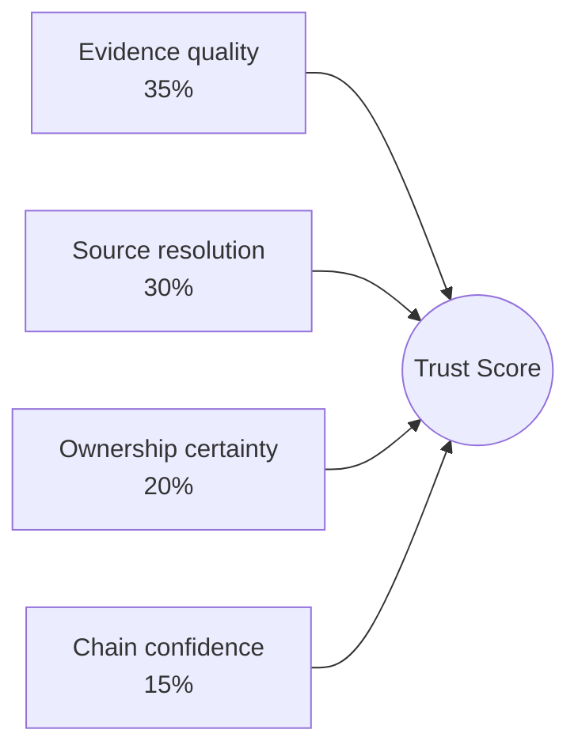

# 8. Trust Score

The Trust Score is one of Beetle's most important and most misunderstood numbers. This
chapter explains exactly what it measures, how it is calculated, and how an analyst should
act on it.

---

## 8.1 What the Trust Score answers

> **"Can an analyst trust these findings?"**

The Trust Score is a 0–100 measure of **report trustworthiness** — how much confidence you
should place in the scan result *as a whole*. It is deliberately distinct from:

- **Severity** — *how bad* the findings are.
- **Security Score** — *how secure* the app is.
- **Reachability / Exploitability** — *how exploitable* the findings are.

A high Trust Score says "the evidence behind this report is strong, findings resolve to
source, ownership is well attributed, and the chains are well-founded." A low Trust Score
says "treat this report with caution — coverage or evidence was weak" — most often because
the app is heavily obfuscated.

> **Don't confuse it with the per-finding "Trust" chip.** The dashboard **Trust Score** card
> documented in this chapter is a *report-level* number. The Findings view also shows a
> per-finding **Trust** chip and a **"Trust ≥"** filter — those are a *different* composite
> (`0.6·confidence + 0.25·fusion + 0.15·evidence`) used to rank individual findings. The two
> share a name but are different formulas over different inputs. See
> [Ch 6 §6.10](06-scoring-systems.md) for the full disambiguation.

It lives in `backend/analyzers/trust_engine.py` (`annotate_trust(results)`), producing
`results["trust_score"]` (`{score, rating, factors, meaning}`) and the supporting
`results["resolution_scores"]`.

---

## 8.2 Why it exists

Every scanner can produce a clean-looking report. The dangerous case is a **false sense of
security**: a high Security Score that is actually the product of poor coverage (the scanner
couldn't see much), not genuine app safety. Without a trustworthiness signal, an analyst
cannot distinguish "this app is clean" from "we couldn't analyze this app well."

The Trust Score makes that distinction explicit and puts it next to the Security Score on the
dashboard, so the **High Security / Low Trust** quadrant — the falsely reassuring report —
is visible rather than hidden ([Ch 6 §6.3](06-scoring-systems.md)).

---

## 8.3 How it is calculated

The Trust Score is a weighted blend of four factors:

| Factor | Weight | What it measures | Source |
|--------|:------:|------------------|--------|
| **Evidence quality** | 35% | Do findings carry strong, renderable evidence? | per-finding `evidence_quality` (HIGH / MEDIUM / LOW) from the Evidence engine |
| **Source resolution** | 30% | What share of findings resolve to a real source `file:line`? | the resolution scanner ([Ch 11](11-source-resolution.md)) |
| **Ownership certainty** | 20% | What share of findings have a known owner (vs "Unknown")? | the Ownership engine ([Ch 14](14-ownership-engine.md)) |
| **Chain confidence** | 15% | How well-founded are the attack chains? | attack-chain `chain_confidence` ([Ch 12](12-attack-chains.md)) |

The weights reflect the philosophy *evidence before assumptions*: the two largest factors
(evidence quality + source resolution = 65%) are about whether findings can be *proven*, not
about how many there are or how severe they are.

### Factor value mapping & edge cases

Two details that resolve common "why is it exactly this?" questions:

- **Evidence quality is mapped to a numeric value** before weighting: `HIGH = 100`,
  `MEDIUM = 60`, `LOW = 25`. So a report whose findings are mostly MEDIUM-quality evidence
  contributes ~60 (not 100) to the 35% factor.
- **A clean or chain-free scan does not get unfairly dragged down.** If a scan has **no
  findings**, the Trust Score is **100 / HIGH** ("nothing to distrust"). If a scan has
  findings but **no attack chains**, the chain-confidence factor defaults to **100** (no
  chains → no chain-confidence drag), so a strong, chain-free report still scores HIGH.

### What is deliberately excluded

**Reachability is intentionally not a factor.** Reachability answers exploitability — a
separate concern. Mixing it in would conflate "can we trust this report" with "can this be
exploited," defeating the orthogonality the score family is built on ([Ch 6 §6.2](06-scoring-systems.md)).

Severity is also not a factor: a report full of criticals is not more or less *trustworthy*
for being severe.

---

## 8.4 Ratings

| Rating | Range | Meaning |
|--------|-------|---------|
| **HIGH** | ≥ 75 | Strong evidence, findings resolve to source, ownership well attributed. Trust the report. |
| **MEDIUM** | 50–74 | Reasonable but imperfect — some findings lack pinned evidence or clear ownership. Verify the important ones. |
| **LOW** | < 50 | Weak evidence/coverage or pervasive "Unknown" ownership (usually obfuscation). Treat conclusions, especially a *clean* result, with caution. |

---

## 8.5 Worked examples

### 8.5.1 ~90% — high trust

An unobfuscated app (e.g. InsecureShop): findings carry exact `file:line` + snippet
evidence (high evidence quality), ~100% source resolution, ~95% ownership certainty, and
well-founded chains. Result: **HIGH (~90+).** Interpretation: *you can act on this report
directly; the findings are well-evidenced and attributed.*

### 8.5.2 ~60% — medium trust

A partially obfuscated app, or one where a meaningful share of findings come from binary/
native code without a pinned source line, or where some chains rest on supporting-only
evidence. Source resolution is good but ownership certainty and evidence quality are mixed.
Result: **MEDIUM (~60).** Interpretation: *the high-confidence findings are solid; manually
verify the medium-evidence ones before reporting.*

### 8.5.3 ~20% — low trust

A heavily obfuscated app where most code lives in single/double-letter packages that
classify as **Unknown** ownership, evidence is weak (binary dumps, no pinned lines), and few
chains form. Result: **LOW (~20).** Interpretation: *do not treat a clean-looking Security
Score as reassurance — the scanner's visibility into this app was limited. Consider dynamic
analysis or a manual review.*

> **Important nuance.** Low Trust from obfuscation does **not** mean the findings are wrong.
> In Beetle's Tier-1 corpus, an obfuscated app reached **100% source resolution and 100%
> evidence coverage** while Trust sat at ~44 — driven entirely by **Unknown ownership** from
> ProGuard/R8. The source still resolved and rendered; only the *package owner* was
> uncertain ([Ch 11](11-source-resolution.md)).

---

## 8.6 How obfuscation moves the score

Obfuscation is the single biggest driver of a low Trust Score, and it acts almost entirely
through the **ownership certainty** factor (20%):

- ProGuard/R8 rename packages/classes to single or double letters (`a.b.c`).
- The Ownership engine cannot match these against its fingerprint database, so they
  classify as **Unknown** (kept visible, never suppressed).
- A high share of Unknown ownership pulls the 20% ownership factor down — and, because
  obfuscated code is harder to attribute symbols to, it can soften evidence quality too.

This is *honest* behavior: Beetle is telling you it could attribute fewer findings, not that
the app is safer or the findings are false. See [Ch 14 §heuristics](14-ownership-engine.md).

---

## 8.7 How analysts should interpret it

1. **Always read Trust Score next to Security Score** (the matrix in [Ch 6 §6.3](06-scoring-systems.md)).
   The combination, not either alone, is the signal.
2. **A LOW Trust Score is a call to add coverage**, not a verdict on the app: deobfuscate,
   run dynamic analysis, or manually review the high-value areas.
3. **A HIGH Trust Score with few findings is the strongest "clean" result Beetle can give.**
4. **Per-finding, use Confidence** ([Ch 10](10-finding-confidence.md)); Trust Score is the
   report-level aggregate, Confidence is the finding-level detail.

---

## 8.8 Relationship to other scores

| Compared with | Difference |
|---------------|------------|
| Security Score | Security = *how secure*; Trust = *how much to believe the report*. Orthogonal. |
| Finding Confidence | Confidence is per-finding; Trust is the report-level aggregate (and shares inputs: evidence, ownership). |
| Reachability | Explicitly excluded from Trust (it's exploitability, not trustworthiness). |
| Source Resolution % | A *direct input* to Trust (30%) and a standalone metric ([Ch 11](11-source-resolution.md)). |

*Insert screenshot of the Trust Score card and its factor breakdown here.*

---

*Next: [Chapter 9 — Security Score](09-security-score.md).*
