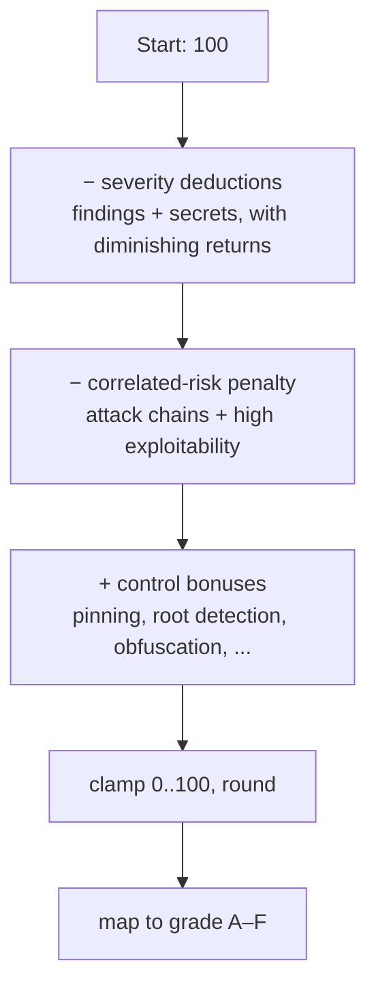

# 9. Security Score

The Security Score is the headline "how secure is this app?" number — a 0–100 value with an
A–F letter grade. This chapter documents exactly how it is computed (from
`backend/analyzers/scoring.py`), what each grade band means, why an app loses points, and
how to improve.

---

## 9.1 What it answers

> **"How secure is this application?"** — higher is safer.

The Security Score starts at a perfect 100 and *deducts* points for findings and secrets,
adds an extra penalty for correlated/reachable risk, then *adds back* bonus points for
positive security controls. The result is clamped to [0, 100] and mapped to a grade.

It is distinct from the Trust Score ([Ch 8](08-trust-score.md)): Security Score measures the
app's posture; Trust Score measures how much to believe the result. Read them together
([Ch 6 §6.3](06-scoring-systems.md)).

---

## 9.2 The calculation, step by step



### Step 1 — Severity deductions

Each finding deducts points by severity weight:

| Severity | Weight (points each) |
|----------|:--------------------:|
| Critical | 15 |
| High | 8 |
| Medium | 3 |
| Low | 1 |
| Informational | 0 |

**Diminishing returns.** The cap is **per severity class, not global**: each class's total
deduction is capped at `3 × weight`, and the classes are summed. So the cap on criticals
(`45`) is independent of the cap on highs (`24`), mediums (`9`), and lows (`3`) — a scan can
still lose points across *several* classes; it just can't lose unboundedly within *one*. The
score reacts to the *first three* findings of a class and then flattens. Examples:

- 1 critical = −15; 3 criticals = −45; **20 criticals still = −45** (capped at `3 × 15`).
- 10 mediums = −9 (capped at `3 × 3`), not −30.
- 3 criticals + 5 highs + 10 mediums = −45 + −24 + −9 = **−78** (each class capped separately).

This is intentional: it stops one noisy category from collapsing the grade, and reflects that
the *presence* of a critical-class problem matters more than the raw count.

### Step 2 — Secret deductions

Detected secrets deduct using the **same** severity weights and the **same** `3 × weight`
per-severity cap, computed **independently** of the findings deduction (so secrets and
findings each have their own per-class caps). Secrets default to medium severity unless the
secret intelligence / validator raised them.

### Step 3 — Correlated-risk penalty

The per-finding severity model *under-counts* correlated risk: an attack chain is worse than
the sum of its individually-counted findings. So an extra penalty is added:

- **+5 per attack chain**, capped at **20**.
- **+10** if overall exploitability ≥ 80, or **+5** if exploitability ≥ 60
  (from the Posture analyzer's `exploitability_score`).

This is the one place reachable, correlated risk explicitly pushes the score down beyond raw
finding counts.

### Step 4 — Control bonuses

Positive security controls add points back (Android):

| Control detected | Bonus |
|------------------|:-----:|
| Certificate pinning | +5 |
| Root detection | +3 |
| SafetyNet / Play Integrity | +3 |
| SQLCipher encryption | +3 |
| Code obfuscation (and *not* "obfuscation not detected") | +3 |
| Frida detection | +2 |
| Screenshot prevention (`FLAG_SECURE`) | +2 |

Bonuses recognize defensive engineering. The obfuscation bonus is guarded so it is only
granted when obfuscation is genuinely present (not when a "obfuscation not detected" finding
exists).

### Step 5 — Clamp, round, grade

```
raw   = max(0, min(100, 100 − total_deducted + total_bonus))
score = round(raw)
```

### Step 6 — Factor breakdown (descriptive)

A per-factor posture object is attached for the UI — attack chains, SSL issues, exported
components, secrets, WebView risks, certificate issues, cleartext traffic, exploitability —
each with a count and an `ok` / `issues` / `review` status. This is **descriptive only**; it
does not double-count against the deductions in Steps 1–3.

---

## 9.3 Grade bands

| Score | Grade | Label | Meaning |
|-------|:-----:|-------|---------|
| ≥ 90 | **A** | Excellent | Very few issues. Strong security practices. |
| ≥ 75 | **B** | Good | Minor issues. Reasonable overall posture. |
| ≥ 60 | **C** | Fair | Moderate issues. Several items need attention. |
| ≥ 40 | **D** | Poor | Significant issues. Immediate remediation recommended. |
| < 40 | **F** | Critical | Critical vulnerabilities. Serious risk to users. |

A companion **Risk level** is set from the worst severity present (Critical if any critical
finding exists, else High, Medium, Low, or Minimal) — see [Ch 7](07-risk-rating.md).

---

## 9.4 What each score range means in practice

| Range | Reading |
|-------|---------|
| **100** | No weighted findings or secrets, controls in place. (Confirm Trust Score — a perfect score on a low-trust scan means *we saw little*, not *it's perfect* — [Ch 8](08-trust-score.md).) |
| **90–99 (A)** | Production-grade posture; only minor/low items. |
| **75–89 (B)** | Good; a few mediums or one high to address. |
| **60–74 (C)** | Fair; multiple issues or a couple of highs; remediation plan needed. |
| **50–59** | Lower D-territory entry; significant gaps. |
| **40–49 (D)** | Poor; serious issues likely including criticals or chains. |
| **30–39** | Solidly F; multiple critical-class problems and/or attack chains. |
| **0–29 (F)** | Critical; an attacker has multiple reachable paths to compromise. |

---

## 9.5 Why applications lose points

In rough order of impact:

1. **Critical findings & validated live secrets** (−15 each up to the cap) — the biggest
   single hit, and a live secret also bumps a finding to critical.
2. **Attack chains** (Step 3, up to −20) — correlated, reachable risk is penalized beyond its
   member findings.
3. **High overall exploitability** (up to −10) — a reachable, dangerous attack surface.
4. **High-severity findings** (−8 each up to the cap) — disabled TLS validation, cleartext
   token transport, debug certs, weak crypto in sensitive paths.
5. **Secrets** — hardcoded credentials, especially application-owned ones.
6. **Mediums/lows** — but heavily damped by diminishing returns.

> Because of diminishing returns, **fixing the first instance of a severity class moves the
> score more than fixing the tenth.** To raise a grade, eliminate whole categories (and the
> chains they enable), not just shave counts.

---

## 9.6 How to improve the score

| Action | Effect |
|--------|--------|
| Remove hardcoded/live secrets from app code | Removes critical-class deductions; un-anchors secret-abuse chains. |
| Break attack chains (fix any one required link) | Removes the −5/chain penalty and lowers exploitability → also reduces Step 3. |
| Enable certificate pinning | +5 bonus *and* removes the missing-pinning finding. |
| Fix TLS-validation bypasses / cleartext | Removes high-severity findings and MitM chains. |
| Add root/tamper detection, Play Integrity, SQLCipher | +3 each. |
| Enable code obfuscation | +3 (note: also lowers *Trust Score* via Unknown ownership — a deliberate, honest trade-off). |
| Reduce exported attack surface | Lowers exploitability → reduces Step 3; removes exported-component chains. |
| Enable `FLAG_SECURE`, Frida detection | +2 each. |

> **Diminishing-returns corollary for improvement:** since each severity class is capped,
> the fastest grade gains come from (a) eliminating any *critical-class* issue, (b) breaking
> *chains*, and (c) banking *bonuses* — not from trimming a long tail of low/medium findings.

---

## 9.7 Edge cases

- **Heavy finding volume, one category.** Capped at `3 × weight`; the score won't free-fall.
- **Obfuscation.** Earns the +3 bonus but lowers Trust Score — Security Score and Trust
  Score move in opposite directions here, which is correct ([Ch 8 §8.6](08-trust-score.md)).
- **Repository (CI/CD) scans.** No Android control bonuses apply; the score reflects CI/CD
  findings and any chains. Grade bands are identical.
- **iOS.** The Android-specific control-name bonuses are keyed to Android control names;
  iOS posture is reflected through findings, secrets and chains. (Bonus tuning for iOS
  control names is a future refinement.)
- **Zero findings.** 100 / Grade A — but the Risk level is "Minimal" and the analyst should
  confirm Trust Score before declaring the app clean.

---

## 9.8 The returned object

For reference, `calculate_score()` returns:

```
score, grade, grade_label, grade_desc, risk,
total_deducted, deductions{per severity}, bonuses[], total_bonus,
factors{attack_chains, ssl_issues, exported_components, secrets,
        webview_risks, certificates, cleartext_traffic, exploitability},
chain_penalty
```

Every component is exposed, so the UI and reports can show *why* the score is what it is —
consistent with Beetle's explainability principle.

---

*Next: [Chapter 10 — Finding Confidence](10-finding-confidence.md).*
