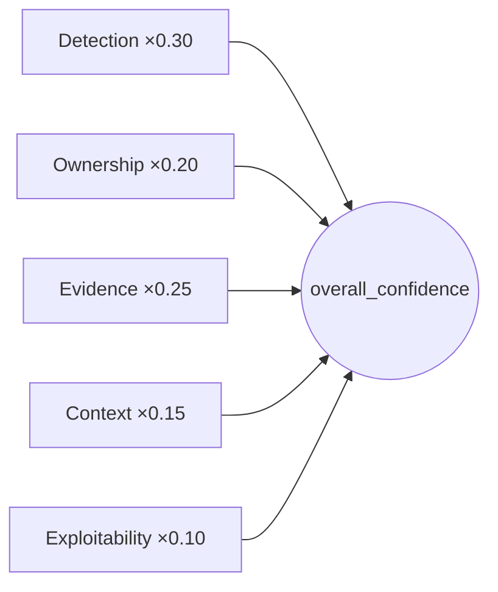

# 10. Finding Confidence

Where the Trust Score ([Ch 8](08-trust-score.md)) is the *report-level* trustworthiness
number, **Confidence** is the *per-finding* one: how much Beetle trusts *this single
finding*. This chapter documents the Confidence engine (`analyzers/confidence/`) — its five
dimensions, the weighting, the decision short-circuits, and how to read it.

---

## 10.1 What confidence is — and is not

> Confidence measures **how much Beetle trusts that this finding is real and well-evidenced.**

It is explicitly **not**:

- **Severity** — *how bad* the finding is.
- **Exploitability** — *how likely* it is to be exploited (exploitability is one *input*, the
  smallest one, not the output).
- **A suppression decision** — confidence informs Triage, but Triage decides visibility.

A finding can be **high severity, low confidence** (a critical-looking pattern we can't
prove) or **low severity, high confidence** (a proven, minor hygiene issue). Keeping these
axes separate is the whole point ([Ch 6 §6.2](06-scoring-systems.md)).

---

## 10.2 The five independent dimensions

The engine scores five dimensions, each 0–100, and — critically — **never collapses them
before the final weighting**, so the breakdown always explains the number.

| Dimension | Question | Driven by |
|-----------|----------|-----------|
| **Detection** | How precise is the detector class that found this? | detector type: structural parsers (manifest/cert) & binary/dependency ≈ deterministic; AST (Semgrep) > regex SAST; secret detectors in between; **a live-validated secret = 100**. Plus a multi-engine **agreement** bonus from Fusion. |
| **Ownership** | How relevant is the owning code? | read directly from the Ownership engine's `owner_confidence` (neutral 50 only if ownership never ran). |
| **Evidence** | How much verifiable proof exists? | additive: base + points per artifact (line, snippet, method, class, resolvable file, decompiler-resolved source, manifest backing, taint/call chain, multiple cross-referenced locations, binary metadata). A claimed-but-unresolved location **caps evidence low**. |
| **Context** | Is there meaningful application context? | `owner_type` (Application 95 … Framework 25, GeneratedCode 30), with an app-config/manifest floor and a neutral score for native libs/resources. |
| **Exploitability** | Could this realistically run? *(conservative, NOT severity)* | starts low; rises only on concrete signals (reachable, exported, externally-controlled taint, dangerous sink, validated secret, chain membership, sensitive permission). Hard caps for unreachable / generated / framework-internal code. |



### Why independence matters

Because the dimensions stay separate, Beetle can distinguish cases a single number would
blur:

| Case | detection | context | exploitability | overall |
|------|----------:|--------:|---------------:|--------:|
| Hardcoded JWT in **app** code | high | high | medium-high | **high** |
| **Generated** BuildConfig secret | high | low | very low | medium |
| **Framework** `eval()` | high | low | low | medium-low |
| Library / SDK finding | medium-high | low | low | lower |
| Documentation URL | medium | low | very low | low |

---

## 10.3 The weighting

```
overall = round( 0.30·detection + 0.20·ownership + 0.25·evidence
                 + 0.15·context  + 0.10·exploitability )
```

The rationale (all in `confidence/config.py`):

- **Detection (0.30)** and **Evidence (0.25)** dominate — *is it real?* and *can we prove
  it?* are what "confidence in a finding" means.
- **Ownership (0.20)** and **Context (0.15)** modulate operational relevance.
- **Exploitability (0.10)** is the smallest factor *here* — so it never overpowers a
  well-evidenced, app-owned finding. (Exploitability has its own, larger role in chains and
  Bug Bounty; in confidence it's just a likelihood nudge, refined later by Reachability.)

No magic numbers: every weight, base and threshold lives in `config.py` with an explanatory
comment, and `CONFIDENCE_VERSION` is bumped on tuning so stored scores stay traceable.

---

## 10.4 Decision-path short-circuits

After the weighted score is computed (and the full breakdown retained), four short-circuits
can override it, each recording a `confidence_stage`:

| Stage | Rule | Why |
|-------|------|-----|
| **Validated** | validated live secret → floor **95** | Deterministic proof beats heuristics. |
| **Correlated** | attack-chain member → floor **85** | Corroboration across a real chain raises trust. |
| **Unresolved-Evidence** | claimed location couldn't be resolved → cap **35** | If we can't open it, we can't be confident. |
| **Weighted** | otherwise | The plain weighted roll-up. |

---

## 10.5 Multi-engine agreement (Fusion → Confidence)

Confidence is not purely per-finding. When Finding Fusion ([Ch 15](15-finding-fusion.md))
collapses the same logical issue detected by several engines, it passes a `detection_count`
to the Confidence engine, which applies a **bounded, explainable** bonus to the *detection*
dimension:

- **+12 per additional independent engine**, capped at **+24**.
- **Damped ×0.5** when the engines disagree on core metadata.

This flows through the normal weights into `overall_confidence` and the human reason — e.g.
*"corroborated by 3 independent engines"* (higher) vs *"corroborated by 3 engines (metadata
conflict — corroboration damped)"* (tempered). A finding that never passed through fusion
(count ≤ 1) is scored exactly as before — the bonus is purely additive.

---

## 10.6 Bands

For display only (never used in the math):

| Band | Range |
|------|-------|
| High | ≥ 75 |
| Medium | ≥ 50 |
| Low | ≥ 25 |
| Informational | < 25 |

> **Two UI subtleties.** (1) The finding card's **Confidence** chip shows HIGH/MEDIUM/LOW; when
> it derives the band from a raw score it uses a simpler 70/40 split (and prefers the
> `evidence_quality` label when present), which can differ slightly from the engine's display
> bands above — the chip is a glance, the breakdown is the truth. (2) The card *also* shows a
> separate **Trust** chip, which is **not** this confidence value — it is a composite of
> confidence + fusion + evidence used for at-a-glance ranking. See
> [Ch 6 §6.10](06-scoring-systems.md) to keep the two apart.

---

## 10.7 Explainability — what every finding carries

```
detection_confidence       0-100
ownership_confidence       0-100   (read from the Ownership engine)
evidence_confidence        0-100
context_confidence         0-100
exploitability_confidence  0-100   (conservative, NOT severity)
overall_confidence         0-100
confidence_reason          str     human "why"
confidence_breakdown       dict    every dimension's score, weight, factors (never hidden)
confidence_stage           str     Weighted | Validated | Correlated | Unresolved-Evidence
confidence_version         str
```

A representative reason: *"Application context; regex SAST detector; code snippet; method
identified; reachable."* Nothing is hidden — the analyst can always open the breakdown and
see which factors raised or capped the number.

> The legacy `confidence` / `confidence_score` fields used by older parts of the pipeline are
> left untouched; the explainable Confidence engine is an additive, parallel signal.

---

## 10.8 How analysts should use it

1. **Filter by it.** The Findings view's **"Trust ≥"** slider ranks findings by the per-finding
   Trust chip, which is confidence-dominated (`0.6·confidence + …`) — set it high to focus on
   the strongest findings during a time-boxed triage ([Ch 5 §5.4.1](05-dashboard-guide.md),
   [Ch 6 §6.10](06-scoring-systems.md)).
2. **Pair it with severity.** Rank by (severity × confidence × reachability). A high-severity,
   low-confidence, unreachable finding sits below a medium-severity, high-confidence,
   reachable one.
3. **Use low confidence as a to-do, not a dismissal.** A low-confidence, high-severity
   finding is a *"verify this manually"* item — open it, check the unresolved evidence, and
   the AI Assistant's *verify* action can help ([Ch 22](22-ai.md)). Beetle never auto-dismisses
   it.
4. **Read the breakdown when a number surprises you.** If a finding you expected to be high
   is medium, the breakdown will show which dimension capped it (usually evidence or context).

---

## 10.9 Relationship to other engines

| Engine | Relationship |
|--------|--------------|
| **Ownership** | Supplies the ownership dimension directly. |
| **Evidence** | Drives the evidence dimension; unresolved evidence triggers the cap. |
| **Secret Intelligence** | A validated/probable secret raises detection; a validated secret triggers the floor-95 short-circuit. |
| **Fusion** | Supplies the multi-engine agreement bonus. |
| **Reachability** | Refines the conservative exploitability dimension downstream. |
| **Triage** | *Consumes* confidence to decide visibility (low confidence + library + weak evidence → hidden-by-default; never the reverse). |
| **Trust Score** | The report-level aggregate; shares the evidence/ownership inputs but is a separate, scan-wide number ([Ch 8](08-trust-score.md)). |

---

*Next: [Chapter 11 — Source Resolution](11-source-resolution.md).*
