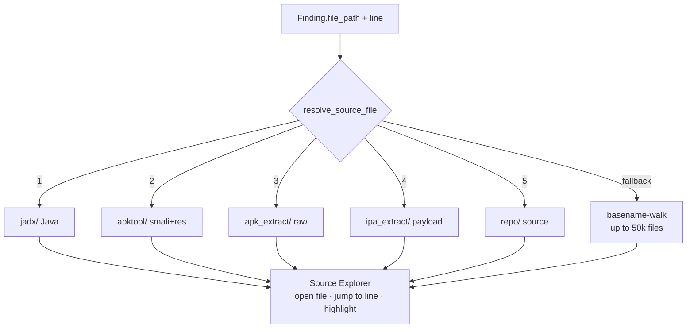

# 11. Source Resolution

A finding you cannot open in the source viewer is a finding you cannot fully trust. **Source
Resolution** is the subsystem that links every finding to the exact line of code it points
at, and it is one of Beetle's defining quality signals. This chapter explains how findings
are located, how evidence is selected and rendered, what "Source Resolution %" means, and
why some findings only have partial evidence.

---

## 11.1 The concepts

| Term | Meaning |
|------|---------|
| **Finding Located** | A finding carries a `file_path` (+ usually `line`) that points at a real artifact in the decompiled/extracted tree. |
| **View Code** | The UI action on a finding/evidence card that opens the **Source Explorer** at that exact file and line, highlighting the snippet. |
| **Source Resolution %** | The share of *source-applicable* findings whose `file_path` actually resolves to a persisted source file. |
| **Renderable Evidence** | A concrete, displayable snippet (code, manifest entry, taint chain) selected as the *best* proof for a finding. |
| **Evidence Confidence** | The evidence dimension of the Confidence engine — how strong/verifiable the proof is ([Ch 10](10-finding-confidence.md)). |
| **Code Navigation** | Jumping from a finding → file → exact line → highlighted region, with breadcrumbs. |
| **Line Resolution** | Pinning a finding to a specific line (vs file-only or class-only). |

---

## 11.2 How Beetle links a finding to source

Findings are produced against decompiled output (JADX Java, apktool smali, raw extraction,
iOS payload, repo tree). When the UI needs the actual file, the backend resolver
(`scan_storage.resolve_source_file()`) searches the persisted scan tree in **priority
order**:

```
jadx/  →  apktool/  →  apk_extract/  →  ipa_extract/  →  repo/
```



- **Priority matters.** JADX Java is searched first because readable Java is the best
  rendering; smali and raw extraction are fallbacks. The precise source scanner prioritizes
  jadx Java over smali/dex when choosing where a finding "lives."
- **Basename-walk fallback.** If the stored path doesn't resolve directly (path
  normalization differs across Windows/Linux, or the path is a legacy `tmpdir` style), the
  resolver walks the tree by basename (capped at 50,000 files) to find the match.
- **Binary sidecars.** Binary files are made viewable via `.txt` printable-strings sidecars
  so even native content can be inspected.

The same resolver powers the file viewer (`GET /api/scans/{id}/file?path=`) and the Source
Explorer tree (`GET /api/scans/{id}/files`) — see [Chapter 21](21-source-explorer.md).

---

## 11.3 Evidence selection — choosing the *best* snippet

A finding can have many candidate locations (multiple files matched a pattern, plus a
manifest entry, plus a taint chain). The **Evidence Selection** subsystem
(`analyzers/evidence_selection/`) picks the single best **renderable evidence** to show, and
the **Evidence Engine** ([Ch 13](13-evidence-engine.md)) builds the full structured bundle
behind it.

Selection prefers, in order:

1. A **resolved source file + exact line + snippet + symbol** (class/method) — fully
   reproducible.
2. A resolved file + line + snippet (no symbol), or a manifest line.
3. A located file without a pinned line, or a class-level/taint-chain reference.
4. A heuristic/reference location with no verifiable snippet.

This ordering is exactly the Evidence **quality** ladder (Excellent → Good → Moderate →
Weak → Missing) in [Chapter 13 §quality](13-evidence-engine.md).

### Noise scrubbing — never point at `classes.dex`

A naive scanner often attributes a finding to a raw `classes.dex` or binary dump. Beetle's
cross-section **noise scrub** (`finding_model.scrub_noise`) re-points any binary-dump
evidence to the best non-binary source path. The result, measured on the Tier-1 corpus:
**zero** findings attributed to a raw `classes.dex`/binary path — every source-applicable
finding lands on readable code.

---

## 11.4 What "Source Resolution %" measures

`source_resolved = True` when a finding's `file_path` resolves to a persisted source file.
The percentage is:

```
Source Resolution % = (source-applicable findings that resolve) / (source-applicable findings)
```

The **denominator excludes** findings that legitimately have no source line — native/binary
hardening findings and certificate-metadata findings — because there is no "line of code" to
point at for them. Including them would unfairly depress the number.

A companion **Evidence Coverage %** is the share of findings carrying *at least one* concrete
evidence artifact (snippet, `file_evidence`, taint chain, or resolvable path).

The validation harness lives in `finding_model.validate_source_resolution`, with a **goal of
> 95%**.

### Measured results (Tier-1 corpus)

| App | Source Res % | Evidence Coverage % | classes.dex-attributed | Unknown ownership |
|-----|:------------:|:-------------------:|:----------------------:|:-----------------:|
| DVBA | **100%** | 100% | 0 | ~56% (obfuscation) |
| InsecureShop | **100%** | 100% | 0 | ~5% |
| Washington Post | **100%** | 100% | 0 | ~45% (obfuscation) |

All three exceed the >95% goal at 100% source resolution and 100% evidence coverage.

---

## 11.5 Why some findings have only partial evidence

Partial evidence is honest, expected, and well-categorized — it is not a bug. Causes:

| Cause | What you see | Why |
|-------|--------------|-----|
| **Native / binary findings** | File-only or symbol-only (no line) | There is no source line in a `.so`/Mach-O; evidence is a symbol or section. |
| **Certificate / signing findings** | Metadata, not a code line | The evidence is the certificate, surfaced as a `Certificate` evidence item. |
| **Manifest-derived findings** | A manifest entry/line | Backed by the real `AndroidManifest.xml` path even if the finding carried none. |
| **Taint flows** | A call chain (entry → path → sink) | The "evidence" is the path itself, rendered as a `TaintFlow` item. |
| **Obfuscation** | Source resolves, but **ownership** is Unknown | The line renders fine; only the *owner* is uncertain (drops Trust Score, not resolution — [Ch 8 §8.6](08-trust-score.md)). |
| **Minified JS / Hermes** | Bundle location, approximate | Production RN bundles are minified; the bundle is shown, not original source. |

> **Key distinction:** *unresolved evidence* (a claimed location that doesn't resolve) caps
> the Confidence evidence dimension at 35 and shows a "Needs Review" verification status —
> Beetle flags it rather than pretending. *Legitimately partial* evidence (native/cert/taint)
> is fully resolved for its kind and is not penalized as if it were missing.

---

## 11.6 Code navigation & line resolution

The finding → source jump is a first-class workflow:

1. Click **View Code** (or **View Smali**) on a finding row, evidence card, or attack-chain
   step.
2. The workspace records an `explorerTarget` and switches to the Source Explorer.
3. The explorer resolves the finding path to the tree's manifest path, **expands the
   ancestor folders**, selects the file, and the code viewer **jumps to the exact line and
   highlights the snippet** (with a highlighted region when start/end lines are known).
4. **Breadcrumbs** show the file's location; in-file search, line numbers and copy are
   available in the viewer.

This works identically across Android, iOS, Flutter, React Native and CI/CD, because every
finding carries `file_path`/`line` and flows through the same resolver. Full UI detail in
[Chapter 21](21-source-explorer.md).

---

## 11.7 Source Resolution and the score family

| Score | Relationship to source resolution |
|-------|-----------------------------------|
| **Trust Score** | Source resolution is a **30%** direct factor ([Ch 8 §8.3](08-trust-score.md)). |
| **Finding Confidence** | The evidence dimension (25%) rewards a resolved file+line+snippet and caps unresolved evidence ([Ch 10 §10.2](10-finding-confidence.md)). |
| **Evidence quality** | Excellent/Good require a resolved line+snippet ([Ch 13](13-evidence-engine.md)). |

High source resolution is therefore not just a UX nicety — it directly raises Trust and
per-finding Confidence, because Beetle rewards findings it can prove.

---

## 11.8 Caveats

- The validation figures above come from an offline harness; taint/Semgrep/manifest findings
  aren't all present there, so the **real pipeline's resolution %** should be re-confirmed in
  the running container (prior full-pipeline runs reported 100% View-Code).
- The basename-walk fallback is capped at 50k files; on extremely large apps a rare path may
  not resolve and the viewer will say so rather than guess.
- Source files are available for the scan's TTL (default 24 h); after cleanup, View Code on an
  old scan is unavailable until a re-scan.

---

*Next: [Chapter 12 — Attack Chains](12-attack-chains.md).*
