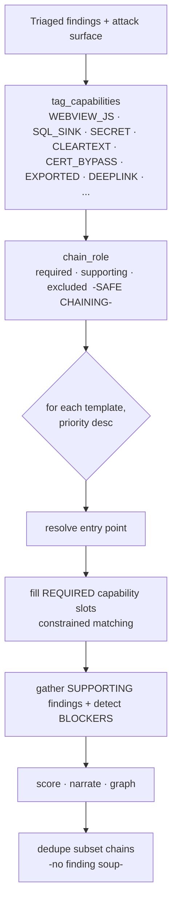

# 12. Attack Chains

Attack Chains are Beetle's flagship analysis capability. A scanner lists weaknesses; Beetle
explains how an attacker **combines** them into a realistic journey through the app. This
chapter documents the Attack Chain engine (`analyzers/attack_chains/`, "v2"): what a chain
is, how it is built, how it is scored, and how to interpret it.

---

## 12.1 What an attack chain is

> The goal is not to connect findings — it is to **explain a realistic attacker journey**.

Each chain answers six questions:

1. **Where does the attack begin?** (the entry point — an exported component, a deep link, a
   reachable external surface, or a synthetic start)
2. **What conditions are required?** (prerequisites)
3. **Which findings participate?** (required vs supporting links)
4. **What is the attacker's objective?** (the goal)
5. **What breaks the chain?** (blocking mitigations)
6. **How confident / exploitable is it?** (evidence-backed scores)

A chain reads as a graph:

```
EntryPoint —exposes→ Component —leads_to→ Finding —leads_to→ … —leads_to→ Goal
                                   ▲
                Mitigation —protects→ Goal       Supporting finding —weakens→ path
```

Crucially, a chain is **evidence-backed end to end**: every step references a member
finding's Evidence Bundle ([Ch 13](13-evidence-engine.md)) — the exact `file:line`, the
resolved class/method, and the `evidence_id` — so an analyst can reproduce every link.

---

## 12.2 The graph model

A chain is a typed graph (`model.py`), serialized on every chain (`chain.graph`) for the UI:

- **Node types:** EntryPoint, Finding, Activity/Service/Receiver/Provider, Permission,
  Intent, Secret, Certificate, Endpoint, Resource, NativeLibrary, WebView, DeepLink, Goal.
- **Edge relations:** uses, requires, exposes, calls, depends_on, leads_to, protects,
  weakens.

The chain also aggregates `affected_files`, `affected_classes`, `affected_methods` and
`evidence_references` from its members.

---

## 12.3 How chains are built



1. **Capability tagging.** Each finding gets deterministic capability tags (e.g. a WebView
   finding → `WEBVIEW_JS`, an exported activity → `EXPORTED`, a SQL sink → `SQL_SINK`).
2. **Role assignment.** Each finding is `required`, `supporting`, or `excluded` under the
   **SAFE-CHAINING** rules (§12.6).
3. **Template matching.** For each chain template (highest priority first), Beetle resolves
   an entry point, fills the **required** capability slots via *constrained matching* (most
   constrained slot first, so a versatile finding isn't greedily consumed), gathers
   supporting findings, and detects blocking mitigations.
4. **Scoring, narration, graphing** (§12.5).
5. **De-duplication.** A chain whose required set is a subset of a higher-priority chain is
   dropped — this is what prevents "finding soup" where every high-severity finding becomes a
   chain.

---

## 12.4 Chain types (templates)

The engine ships modular templates; `register()` adds more without touching engine logic.

| Template | Attacker journey |
|----------|------------------|
| **WebView JS-bridge RCE** | Reach a WebView with a JS interface → execute code in-app. |
| **Deep-link → WebView file disclosure** | A deep link drives a WebView to read `file://` → exfiltrate app data. |
| **Exported-component SQL injection** | An exported component reaches a SQL sink with attacker input. |
| **Command injection / RCE** | Attacker input reaches `Runtime.exec`/`ProcessBuilder`. |
| **Dynamic code loading / reflection RCE** | Reachable `DexClassLoader`/reflection loads attacker-influenced code. |
| **Exported ContentProvider file disclosure** | Path traversal via an exported provider. |
| **Cleartext-traffic token theft** | Cleartext transport of a token enables MitM capture. |
| **Disabled-cert-validation MitM** | TLS validation bypass enables interception. |
| **Hardcoded secret / API-key abuse** | A real (ideally validated) secret grants backend access. |
| **Insecure-storage theft** | Sensitive data in plaintext storage + a path to read it. |
| **Backup-enabled extraction** | `allowBackup` enables data extraction. |
| **Debuggable extraction** | `debuggable` enables runtime data access. |
| **Weak-crypto exposure** | Weak crypto on sensitive data + a path to the ciphertext. |

Each template is a small descriptor: entry, required slots, supporting capabilities,
blockers, goal, mitigations.

---

## 12.5 Scoring (no arbitrary numbers)

Every chain score is derived from the prior engines, never invented:

- **overall_confidence** = `0.55 · mean(member overall_confidence) + 0.45 · mean(member
  evidence score)`, scaled by an **entry-reachability multiplier** (reachable-external 1.0,
  distribution 0.95, unproven-external 0.85, device-access 0.75). This is the
  `chain_confidence` that feeds the Trust Score ([Ch 8](08-trust-score.md)).
- **overall_evidence_quality** = the *worst* required member's evidence band — a chain is
  only as verifiable as its weakest required link.
- **overall_exploitability** = entry-kind base blended with members'
  `exploitability_confidence`, +app-control bonus, −blocked penalty.
- **severity** = a goal-based floor, downgraded when exploitability is low or the chain is
  blocked.

> **Chains never change a finding's severity or confidence.** Chain scores are *chain-level
> properties*; the member findings keep their own values. The chain is an additive lens, not
> a re-rating.

Each chain carries a `confidence_explanation` recording **why the chain exists, why each
member belongs, which findings were rejected, why the confidence, and why the
exploitability** — fully auditable.

---

## 12.6 SAFE-CHAINING — false-positive avoidance

Driven by Triage, Secret Intelligence and Ownership, three rules keep chains realistic:

- **Never a required link:** framework noise, suppressed findings, documentation examples,
  false-positive/public/generated-constant secrets, generated code.
- **Supporting only:** framework/SDK findings that provide a *structural vehicle* (a WebView,
  an exported component) may appear as supporting context, but cannot be the crux.
- **Finding-soup avoidance:** a single unrelated high-severity finding never becomes a chain;
  templates require specific capability *combinations*, and subset chains are de-duplicated.

The effect: dramatically fewer false-positive chains, framework noise excluded, Android and
iOS supported equally.

---

## 12.7 How multiple findings become one chain — a worked example

> **WebView JS-bridge RCE.**
> 1. **Entry point:** an *exported* `Activity` (capability `EXPORTED`) — from the manifest /
>    component inventory.
> 2. **Required link:** a WebView with `setJavaScriptEnabled(true)` + `addJavascriptInterface`
>    (capability `WEBVIEW_JS`) — an application-owned SAST finding with an exact `file:line`.
> 3. **Supporting:** a cleartext-traffic finding (`CLEARTEXT`) that lets an attacker inject
>    content over the network — it *weakens* the path but isn't required.
> 4. **Blocker check:** is there input validation / a `@JavascriptInterface` allowlist /
>    target-SDK mitigation? If yes, the chain is marked *blocked* and downgraded.
> 5. **Goal:** code execution in the app sandbox.
>
> The result is **one** chain crediting both findings, with a confidence derived from their
> member confidences and evidence, an exploitability from the exported-entry base, a
> step-by-step narrative, a graph, and per-step `file:line` evidence references. Neither
> member finding's own severity changes.

---

## 12.8 Interpretation guide

- **Start at the Most Exploitable Chain** on the Overview ([Ch 5 §5.3](05-dashboard-guide.md)).
  It is the single best "what would an attacker do first" answer.
- **A chain is a remediation lever.** Because a chain requires *all* its required links,
  fixing **any one** required link breaks it — and removes the Security-Score chain penalty
  ([Ch 9 §9.2](09-security-score.md)). Pick the cheapest required link to fix.
- **Read the blockers.** A *blocked* chain is documented but downgraded — useful to confirm a
  mitigation is actually doing its job.
- **Use the evidence references** to reproduce each link; the chain is only as credible as its
  weakest required evidence, which is exactly what `overall_evidence_quality` reports.
- **Cloud attack paths** appear alongside code chains: validated credential + confirmed
  exposure = HIGH; unvalidated + exposure = MEDIUM; credential only = LOW (suppressed by
  default) — from the cloud correlation engine ([Ch 4 §4.24](04-intelligence-engines.md)).

---

## 12.9 Limitations

- Chains are **static**: they assert a plausible, evidence-linked path, not a verified
  exploit. They identify *where to point a PoC*, not a working exploit.
- Coverage is the template set above; novel attack classes need a new template (a data-only
  `register()` addition).
- Reachability is static; runtime/dynamic analysis would promote chains from "external" to
  "external_reachable" (a designed future input).
- The legacy v1 chain output still exists for compatibility; v2 (`attack_chains_v2`) is the
  authoritative, evidence-backed engine documented here.

---

## 12.10 Integration map

| Engine | Used by chains for |
|--------|--------------------|
| Ownership | app-control bonus; framework/SDK excluded from required links |
| Confidence | member `overall_confidence` + `exploitability_confidence` feed chain scoring |
| Secret Intelligence | only real secrets become SECRET/API-KEY links; FP/doc/public excluded |
| Evidence | per-step `file:line`/class/method references; weakest-link evidence band |
| Triage | `decision`/`visibility` set each finding's chaining role |
| Reachability / Posture | entry reachability sets the confidence multiplier & exploitability base |
| Bug Bounty | each chain gets its own reportability score + remediation priority ([Ch 4 §4.22](04-intelligence-engines.md)) |

Determinism + a `CHAIN_VERSION` make chains comparable across releases (drift is
detectable). The UI visualizes `chain.graph` and the narrative directly from this data — see
[Chapter 5 §5.5](05-dashboard-guide.md).

---

*Next: [Chapter 13 — Evidence Engine](13-evidence-engine.md).*
