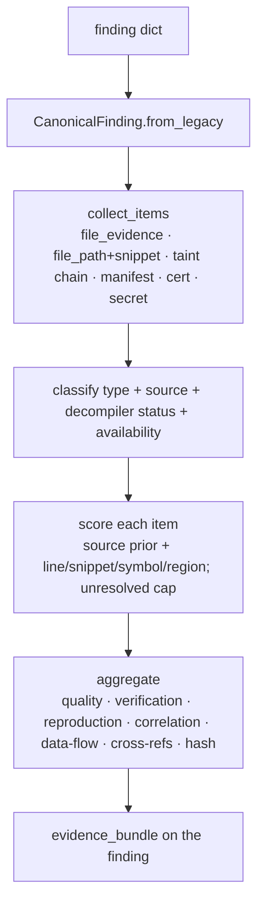

# 13. Evidence Engine

> *"A security finding is only as valuable as the evidence supporting it."*

The Evidence Engine (`analyzers/evidence/`) makes evidence a **first-class, structured,
reusable** component. For every finding it builds one aggregated, multi-source evidence
bundle — typed items with quality, verification status, reproduction steps, correlation, a
data-flow view, and a deterministic content hash — so every finding is explainable,
reproducible, and easy to verify by a human, an AI, a consultant, or a bug-bounty hunter.

This chapter documents the structured model. The closely related question of *which file/
line gets rendered* and *Source Resolution %* is in [Chapter 11](11-source-resolution.md).

---

## 13.1 Why a dedicated evidence model

Detection engines emit loose evidence: a `snippet` string here, a `file_evidence` list
there, a taint chain elsewhere. That is hard to reason over uniformly. The Evidence Engine
**aggregates** all of it into one normalized `evidence_bundle` per finding, without ever
overwriting the loose fields (both are preserved for backward compatibility). The bundle is
what powers evidence cards, "how to reproduce," quality/verification badges, and the
evidence references in attack chains.

---

## 13.2 The model

### `EvidenceItem` — one verifiable piece of evidence

```
id, type, source, confidence,
file_path, relative_path, line, column, end_line/end_column,   # location & region
snippet, decompiler_status, source_availability, generated_code,
locator{ class, method, package, namespace, component, permission, intent,
         uri, deep_link, resource_name, property, field, function,
         native_library, swift_module, objc_class, jni_library,
         source, sink, caller, callee },
metadata
```

The long, sparse list of named locations lives in `locator` (a dict), so new locator kinds
are added without breaking compatibility.

### `Evidence` — the aggregated bundle

```
evidence_id, version, items[], primary, evidence_types[], sources[],
quality, quality_reason, verification_status, verification_reason,
source_availability, generated_code, reproducible, reproduction{},
correlation[], data_flow{}, cross_references[],
ownership{}, confidence{}, secret{},
content_hash, timestamp, item_count, location_count
```

It is attached to a finding as `evidence_bundle` (named so it never collides with the legacy
`evidence` snippet string or the `file_evidence` list — both preserved).

### Evidence types

`SourceCode, DecompiledJava, Kotlin, Smali, Swift, ObjectiveC, Manifest, InfoPlist,
ResourceXML, StringsXML, NetworkSecurityConfig, JSON, YAML, Gradle, Configuration,
Properties, Database, SharedPreferences, Assets, RawResources, Binary, MachO, DEX,
NativeLibrary, JNI, Certificate, CodeSignature, WebView, JavaScript, HTML, CSS, SQL,
CallGraph, TaintFlow, Dependency, APK/IPA-Metadata, Flutter, ReactNative, Cordova,
Capacitor, Unity, Secret, Unknown.` Type is resolved from basename → path token → extension
→ finding category.

---

## 13.3 The lifecycle



`annotate(results)` runs in both orchestrators **after** Ownership and Confidence (so it can
summarize their metadata), guarded and additive-only, and emits a scan-level
`evidence_summary` (quality distribution).

---

## 13.4 Multi-source collection — never overwrite

A finding can carry evidence from many places; the engine **aggregates** rather than
overwrites:

- every `file_evidence` entry → a code/resource item (N items, N locations);
- a taint/call chain → a `TaintFlow` item with entry/exit/path;
- manifest-derived findings → a `Manifest`/`InfoPlist` item (with the *real* manifest path
  even when the finding carried none);
- certificate findings → a `Certificate` item;
- secret findings → a `Secret` item linking the Secret Intelligence assessment.

`cross_references` lists the non-primary locations; `location_count` counts distinct
`(file, line)` pairs.

---

## 13.5 Quality

| Quality | Meaning |
|---------|---------|
| **Excellent** | exact file + line + snippet + symbol, source resolved — reproducible by line |
| **Good** | exact file + line + snippet (no symbol), or a manifest line |
| **Moderate** | located evidence without a pinned line, class-level, or a taint chain |
| **Weak** | reference/heuristic location only, no verifiable snippet |
| **Missing** | no evidence at all |

The band is decided structurally (with an explanation) and **capped by the primary item's
numeric confidence**, so it never over-claims. Every decision carries `quality_reason`. This
ladder is exactly what feeds the Confidence evidence dimension ([Ch 10](10-finding-confidence.md))
and the Trust Score's evidence factor ([Ch 8](08-trust-score.md)).

---

## 13.6 Verification

Each finding's evidence carries a verification status (+ `verification_reason`):

`Verified` (resolved source + exact line + snippet) · `Partially Verified` · `Decompiler
Only` · `Manifest Only` · `Binary Only` · `Generated` (machine-generated code) · `Needs
Review` (a claimed location could not be resolved) · `Unknown`.

> `Needs Review` is the honest flag for *unresolved evidence* — it pairs with the Confidence
> engine's evidence cap of 35 ([Ch 10 §10.4](10-finding-confidence.md)). Beetle never
> pretends a location it couldn't open is verified.

---

## 13.7 Reproducibility

The `reproduction` object gives an analyst the exact recipe: `file, line, class, method,
manifest_entry, call_path, snippet` plus tailored `steps`:

- **Code:** decompile → open file → go to line.
- **Manifest:** decode manifest → locate entry.
- **Binary:** extract → inspect symbol.
- **Taint:** source → path → sink.

`reproducible` is `True` for Excellent/Good items with a file + line. This is what the
report's "how to reproduce" cards and the attack-chain step references are built from.

---

## 13.8 Correlation

Deterministic relationships a reviewer would draw by hand are emitted as `correlation` edges
between items:

- `manifest_declares_source` — an exported component's manifest entry ↔ its implementing
  class.
- `same_class`, `same_file` — co-located evidence.
- `source_participates_in_flow` — a source line ↔ a taint flow.

This realizes the *Manifest → Activity → Source → Intent → Permission → Deep Link* and
*Secret → BuildConfig → Package → Ownership* relationships on evidence already present, and
is what attack chains consume to link steps (Git-history and dynamic correlation are future
inputs).

---

## 13.9 Determinism & content hashing

The engine is pure and deterministic: same finding → identical bundle. `content_hash` is the
SHA-256 of the normalized item set (`type|file|line|snippet`) and seeds `evidence_id`
(`EV-<hash[:12]>`). The only injected value is the scan **timestamp**, which is *excluded*
from the hash — so the hash is stable across re-scans of the same artifact. This makes the
bundle ideal for a **golden-regression suite** that detects evidence drift between releases.

---

## 13.10 Extensibility & consumers

- New evidence type / file kind → one line in `config.py`.
- New locator kind → a key in `EvidenceItem.locator` (no schema change).
- New collection source (e.g. runtime/Frida) → an item producer in `collect_items`,
  corroborating static evidence under the same bundle.

| Consumer | Uses the bundle for |
|----------|---------------------|
| Triage | `verification_status` + ownership to group library/framework noise |
| Bug Bounty | surface only Excellent/Good, Verified, reproducible findings |
| Attack Chains v2 | `correlation` + `data_flow` to build evidence-linked chains |
| AI Assistant | items + reproduction + verification as grounded context ([Ch 22](22-ai.md)) |
| Reports | typed evidence cards, "how to reproduce", quality/verification badges |
| Golden regression | `content_hash` to detect evidence drift |

---

## 13.11 Compatibility

`annotate()` writes only `evidence_bundle` (+ scan-level `evidence_summary`). The loose
`file_evidence` / `snippet` / `evidence` fields, severity, suppression, reports and the UI
are untouched — the structured model is purely additive.

---

*Next: [Chapter 14 — Ownership Engine](14-ownership-engine.md).*
