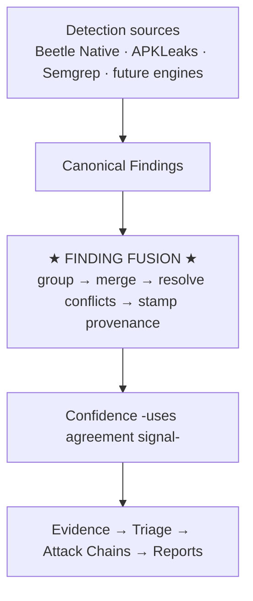

# 15. Finding Fusion

The Finding Fusion Engine (`analyzers/fusion/`) is the architectural seam that lets Beetle
grow from a few detection engines to **many** — Beetle Native, APKLeaks, Semgrep, and future
MobSF/YARA/AI detectors — **without increasing report noise**. Every detector only has to
*emit* canonical findings; Fusion is solely responsible for recognizing when several of them
describe the **same logical issue** and folding them into **one** canonical finding that is
"Detected By" all of them, with complete, explainable provenance.

> The user never sees a duplicate finding just because multiple engines detected it.

---

## 15.1 Where it sits



Fusion runs as **one deterministic pipeline stage** over `results["findings"]`, replacing the
old exact-key dedupe, at the same point in both the Android and iOS orchestrators — **after**
canonicalization, **before** the Confidence engine (so the multi-engine agreement signal can
feed confidence, [Ch 10 §10.5](10-finding-confidence.md)).

### Two layers (they compose)

| Layer | When | Scope | Keyed on |
|-------|------|-------|----------|
| `detection_sources/fusion.py` | detection time | merges detection *streams* (secrets/endpoints) + the secret→finding bridge | exact rule/value |
| `analyzers/fusion/` (this chapter) | finalize | finding-level *semantic* fusion across ALL engines | semantic identity (CWE/class + location) |

The stream layer collapses native + APKLeaks hits sharing an exact rule name up front. This
engine is the superset that also unifies **cross-engine equivalents** — different rule ids,
different titles, small line drift.

---

## 15.2 Merge strategy

### Step 1 — Group by semantic identity

```
fusion_key = (issue_class, file, line_bucket[, value_fingerprint])
```

- **`issue_class`** is resolved, in priority order: an **alias-registry** entry for this
  `(engine, rule_id)` → the **CWE** id → a normalized `category:title`. A *specific* CWE is
  the strongest cross-engine signal: Beetle "AWS Access Key ID" and Semgrep
  "hardcoded-aws-credentials" both carry **CWE-798**, so they land in one class despite
  different rule ids and titles.
- **Broad-CWE guard.** Some CWEs are umbrellas shared by many distinct rules (CWE-327 covers
  AES-ECB *and* weak-DES *and* weak-hash; CWE-312, CWE-200, CWE-319 likewise). For these the
  CWE alone is **not** enough identity — keying on it would merge genuinely different findings
  a few lines apart and silently drop one. So a broad-CWE class also factors the normalized
  **title** (unless a `value_fingerprint` already separates them). Specific CWEs keep CWE-only
  identity so true cross-engine duplicates still merge.
- **`line_bucket`** (default ±3) tolerates small line drift between engines without merging
  separate issues.
- **`value_fingerprint`** keeps two *different* secret literals in the same file apart, while
  letting two engines on the *same* literal merge.

Attack-chain findings and malformed entries are passed through untouched (they are not engine
duplicates).

### Step 2 — Fold the group

`CanonicalFinding.merge` unions evidence / sources / references / standards (CWE/MASVS/OWASP),
keeps the higher severity and confidence, and unions `detected_by` / `sources`.

### Step 3 — Resolve conflicts (deterministic, documented)

### Step 4 — Stamp provenance on every finding (fused *and* singleton).

---

## 15.3 Conflict resolution

When engines disagree, every decision is resolved *and recorded* in
`finding["fusion"]["conflicts"]` as a structured record `{field, values, chosen, rule}`:

| Field | Rule | Rationale |
|-------|------|-----------|
| **Severity** | Most severe wins | Tools under-rate as often as over-rate — trust the worst case. |
| **Category** | Category precedence table | The most security-meaningful label wins (e.g. "Cloud Credentials" over "Secrets"). |
| **Ownership** | Highest `owner_confidence` wins | `Unknown` never beats a concrete owner. |
| **Location** | Strongest evidence (validated > has-snippet > most file-evidence) | Only a different file or beyond-bucket line drift is a conflict; all locations kept as `merged_locations`. |
| **Confidence** | Not resolved here | Surfaced as `fusion_score` + a documented spread. |

---

## 15.4 Multi-engine agreement → Confidence

Confidence is no longer pure per-finding heuristics. The Confidence engine reads Fusion's
`detection_count` and applies a **bounded, explainable** bonus to the *detection* dimension:

- **+12 per additional independent engine**, capped at **+24**.
- **Damped ×0.5** when engines disagree on core metadata.

Example reasons: *"corroborated by 3 independent engines"* (higher) vs *"corroborated by 3
engines (metadata conflict — corroboration damped)"* (tempered). Additive: a finding that
never fused (count ≤ 1) is scored exactly as before.

---

## 15.5 Provenance on every finding

| Field | Meaning |
|-------|---------|
| `detected_by` | list of engines that found it |
| `detection_count` | number of distinct engines |
| `sources` | per-engine detail `[{engine, rule_id, confidence}]` (unioned) |
| `fusion_score` | 0–100 corroboration strength |
| `evidence_count` | distinct evidence locations |
| `merged_files` | every file the issue was seen in |
| `merged_locations` | every `(file, line)` it was seen at |
| `fusion` | full record: version, detection_count, engines, sources, conflicts, resolutions, score, reason |

```
fusion_score = BASE(50) + PER_ENGINE(18)·(count−1) + EVIDENCE(4·extra, cap 16)
             − CONFLICT_PENALTY(15 if any conflict),  clamped 0–100
```

A per-scan rollup is stored at `results["fusion_summary"]`
(`{version, before, after, groups, merged, multi_engine, passthrough}`).

---

## 15.6 What the analyst sees

Because fusion collapses duplicates to one canonical finding, every surface (UI / PDF / HTML
/ JSON / SARIF / dashboard) shows **one** finding carrying the agreement signal:

```
AWS Access Key ID                                    CRITICAL
Detected By:  Beetle Native · APKLeaks · Semgrep
Confidence:   95%
Reason:       Detected independently by 3 engines. No metadata conflicts.
```

The Findings filter bar lets you filter by **detection source** — e.g. "show only findings
Semgrep agreed on" — directly off `detected_by` ([Ch 5 §5.4](05-dashboard-guide.md)).

---

## 15.7 Adding a detection engine (zero pipeline change)

1. The engine emits canonical-shaped findings into `results["findings"]` with `detected_by` /
   `sources` (and ideally a CWE).
2. Fusion groups, merges, resolves and scores them automatically.
3. If the engine uses an idiosyncratic rule name that shares neither CWE nor title with an
   existing rule, declare the equivalence with **data only**:

   ```python
   from analyzers.fusion import identity
   identity.register_alias("MobSF", "android_insecure_webview", "cwe-749")
   ```

No engine "knows" about fusion; fusion performs the merge. This is the seam that keeps report
noise flat as the number of detectors grows — and it is why Flutter, React Native and CI/CD
findings ([Ch 19](19-framework-intelligence.md), [Ch 3](03-scan-targets.md)) integrated
without any fusion change.

---

## 15.8 Robustness (verified)

A post-implementation audit confirmed:

- **Broad-CWE over-merge → data loss** was a real defect (two CWE-327 rules a few lines apart
  collapsed, dropping one) — **fixed** by the broad-CWE guard (§15.2).
- **Idempotency / order-independence** — re-running fuse, and reversing input order, yield
  identical findings and provenance.
- **Android == iOS** — identical fusion output for identical input.
- **Masked-vs-raw secret fingerprints** — not reachable in the live pipeline (masking happens
  in the secret→finding bridge, *after* fuse; bridged findings carry unique rule ids so they
  never fuse-merge).

---

*Next: [Chapter 16 — Reports](16-reports.md).*
