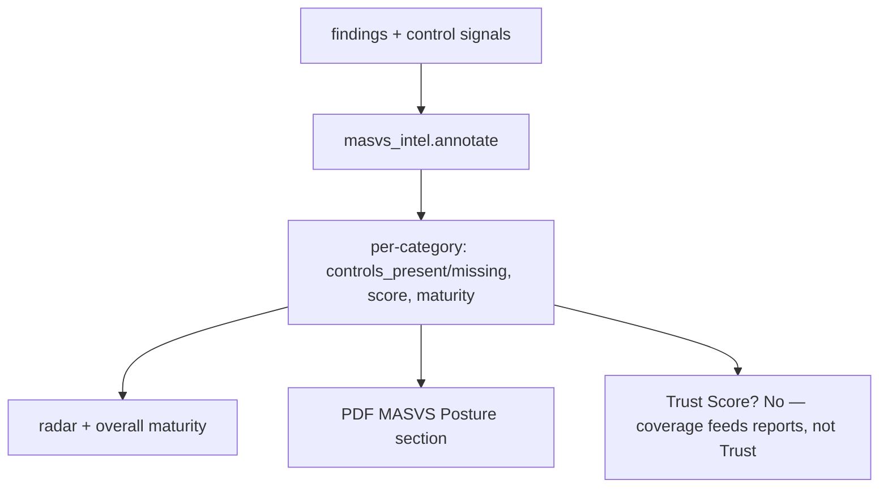

# 17. MASVS Coverage

OWASP **MASVS** (Mobile Application Security Verification Standard) is the industry reference
for *what a secure mobile app should do*. Beetle maps its analysis onto MASVS to answer a
question a flat finding list cannot: **"how much of the standard does this app actually
implement?"** This chapter explains MASVS coverage — its model, scoring, signals, and
limits.

---

## 17.1 What MASVS is (briefly)

MASVS v2 organizes mobile security requirements into eight control groups:

| Category | Focus |
|----------|-------|
| **MASVS-STORAGE** | Secure storage of sensitive data. |
| **MASVS-CRYPTO** | Correct, modern cryptography. |
| **MASVS-AUTH** | Authentication & authorization. |
| **MASVS-NETWORK** | Secure network communication. |
| **MASVS-PLATFORM** | Safe platform interaction (IPC, WebViews, deep links). |
| **MASVS-CODE** | Code quality & exploit mitigations. |
| **MASVS-RESILIENCE** | Resistance to reverse engineering & tampering. |
| **MASVS-PRIVACY** | User-privacy protections. |

MASVS is a **requirements / maturity** standard, not a severity scale — which is why Beetle
treats it as *coverage*, not as another finding count.

---

## 17.2 What Beetle's MASVS coverage answers

> **"How much of the OWASP MASVS is implemented?"** — posture, not a vulnerability count.

It lets Beetle say *"Cryptography maturity is weak"* rather than *"5 crypto findings."* That
distinction is the whole value: a category can have zero findings because the app handles it
well, or because Beetle couldn't observe it — coverage maturity makes that explicit.

It lives in `backend/analyzers/masvs_intel.py` (`annotate(results)`), producing
`results["masvs_coverage"]` (per-category) and `results["masvs_summary"]`.

---

## 17.3 The per-category model

For each of the eight categories Beetle produces:

```
{ category, controls_present, controls_missing,
  score (0–100), maturity (weak | moderate | strong),
  confidence, evidence }
```

- **controls_present / controls_missing** — which expected controls were detected vs not.
- **score** — a 0–100 coverage score (§17.4).
- **maturity** — a band: *weak / moderate / strong*.
- **confidence / evidence** — how sure Beetle is, and what it observed.

---

## 17.4 How coverage is scored

```
score = control coverage (≤ 60)  +  hygiene (≤ 40 − severity-weighted weaknesses)
```

Two components:

1. **Control coverage (up to 60 points)** — how many of the category's expected positive
   controls were detected.
2. **Hygiene (up to 40 points)** — starts near full and is reduced by severity-weighted
   *weaknesses* (findings) in that category.

So a category scores high when it both **implements the right controls** *and* **has few
weaknesses**; it scores low when controls are absent or weaknesses pile up. The maturity band
(weak/moderate/strong) is derived from the score.

---

## 17.5 Positive control signals

Coverage credit is driven by **detecting controls that are actually present**, not by absence
of findings. Beetle looks for, among others:

- Network Security Config present
- Certificate Pinning
- No Cleartext traffic
- Biometric Authentication
- Keystore / Keychain-backed keys
- Encrypted Storage
- Root / Tamper Detection
- Integrity / Attestation (SafetyNet / Play Integrity)
- Strong App Signing

These are detected over a **positive corpus** with a **negation guard** — so a string like
"no certificate pinning" is *not* miscounted as the control being present. This guard is what
keeps coverage honest.

---

## 17.6 The coverage radar

The MASVS Coverage workspace section renders a **radar chart** of the eight categories
(each plotted by `score`), an overall score, and an overall maturity band, plus a per-category
list sorted weakest-first with a maturity-colored bar. The Overview dashboard shows a compact
version ([Ch 5 §5.14, §5.3.6](05-dashboard-guide.md)).



*Insert screenshot of the MASVS Coverage radar here.*

---

## 17.7 How to interpret coverage

| Category maturity | Reading |
|-------------------|---------|
| **Strong** | Expected controls detected and few weaknesses. Good posture for that area. |
| **Moderate** | Some controls present; gaps or weaknesses remain. |
| **Weak** | Controls absent and/or significant weaknesses. Prioritize. |

> **Coverage maturity ≠ a pass/fail audit.** "Strong CRYPTO" means *Beetle observed strong
> crypto controls and few crypto weaknesses*, not that every MASVS-CRYPTO control was
> formally verified. Use coverage to *direct attention* (which areas are weakest), and the
> Findings + Attack Chains to act on specifics.

Worked reading: an app with MASVS-NETWORK **weak** but MASVS-STORAGE **strong** is telling
you the network layer (pinning, cleartext, TLS validation) is where the real exposure is —
go to the Network findings and the cert-bypass/cleartext attack chains first.

---

## 17.8 Coverage vs severity vs the Compliance PDF

| Surface | Question | Chapter |
|---------|----------|---------|
| **MASVS coverage** (this chapter) | How much of the standard is implemented? (maturity) | 17 |
| **Per-finding MASVS mapping** | Which MASVS category does this specific issue violate? | [7](07-risk-rating.md) |
| **Compliance PDF** | Pass/fail control mapping for an audit deliverable | [16 §16.4](16-reports.md) |

The Compliance PDF's static pass/fail and this chapter's *coverage maturity* are
complementary: maturity is explicit about *what was checked and how mature it looked*, which
is exactly the caveat to read alongside a compliance "pass."

---

## 17.9 Limitations

- Coverage is inferred from static signals; a control implemented in a way Beetle doesn't
  recognize will be under-credited (improving as the positive corpus grows).
- The control catalog and scoring weights are tuned against a Tier-1 corpus and continue to
  be refined; per-category control catalogs are being expanded.
- Coverage measures *posture*, not exploitability — pair it with Attack Chains and
  reachability for the "can it be attacked" view.

---

*Next: [Chapter 18 — OWASP Coverage](18-owasp-coverage.md).*
