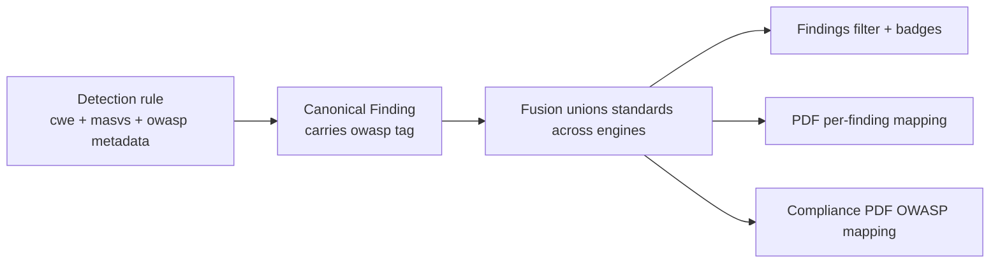

# 18. OWASP Coverage

Beetle maps findings to the **OWASP Mobile Top 10** (and, where relevant, classic OWASP /
CWE pairings). This chapter explains the mapping model, how a finding lands in a category,
and how OWASP coverage relates to MASVS and severity.

---

## 18.1 The OWASP Mobile Top 10 categories

| ID | Category | Typical Beetle findings |
|----|----------|-------------------------|
| **M1** | Improper Credential Usage | Hardcoded/validated secrets, embedded API keys, basic-auth URLs. |
| **M2** | Inadequate Supply Chain Security | Vulnerable native libs / dependencies (OSV + KEV), risky SDKs, unpinned CI actions. |
| **M3** | Insecure Authentication/Authorization | Weak auth flows, exported components without permission guards. |
| **M4** | Insufficient Input/Output Validation | Injection sinks (SQL, command), unvalidated intents/deep links, taint flows. |
| **M5** | Insecure Communication | Cleartext traffic, disabled TLS validation, missing pinning, weak NSC. |
| **M6** | Inadequate Privacy Controls | Trackers, PII leakage, excessive permissions, recon identifiers. |
| **M7** | Insufficient Binary Protections | Missing hardening (PIE/NX/canary/RELRO), no obfuscation, no tamper detection. |
| **M8** | Security Misconfiguration | `debuggable`, `allowBackup`, exported surface, misconfigured NSC, CI misconfig. |
| **M9** | Insecure Data Storage | Plaintext SharedPreferences/AsyncStorage/Keychain misuse, unencrypted DBs. |
| **M10** | Insufficient Cryptography | Weak algorithms (DES/RC4/MD5/SHA-1), ECB mode, hardcoded keys/salts/IVs, weak RSA. |

---

## 18.2 How findings map to OWASP categories

Mapping is **rule-driven, not inferred at report time**. Every SAST rule, secret type,
manifest check and binary check carries explicit `owasp` (and `cwe`, `masvs`) metadata. When
a detector emits a finding, the OWASP category travels with it as a first-class field.

Three consequences of doing it at the rule level:

1. **Consistency.** The same issue always maps to the same OWASP category, regardless of which
   engine detected it.
2. **Fusion preserves it.** When Finding Fusion ([Ch 15](15-finding-fusion.md)) merges a
   finding detected by several engines, it **unions** the standards metadata — so the fused
   finding carries the OWASP/CWE/MASVS tags from all contributing rules.
3. **It's filterable and reportable.** OWASP tags appear as finding badges, are rolled up in
   the Compliance PDF, and tag attack chains (each chain lists its OWASP/MASVS mapping —
   [Ch 12](12-attack-chains.md)).

---

## 18.3 CWE as the bridge

Most rules also carry a **CWE** id, and CWE is the strongest cross-engine identity signal in
Fusion. The chain is: a rule's CWE both (a) anchors its OWASP/MASVS mapping and (b) lets
Fusion recognize that two engines' differently-named rules describe the same weakness
(e.g. both carry CWE-798 → Improper Credential Usage / M1). So the OWASP mapping and the
de-duplication are powered by the same metadata.

| Example finding | CWE | OWASP Mobile | MASVS |
|-----------------|-----|--------------|-------|
| Hardcoded AWS key | CWE-798 | M1 | MASVS-STORAGE / CRYPTO |
| Cleartext traffic | CWE-319 | M5 | MASVS-NETWORK |
| `addJavascriptInterface` RCE | CWE-749 | M4/M8 | MASVS-PLATFORM |
| AES/ECB | CWE-327 | M10 | MASVS-CRYPTO |
| Vulnerable `zlib` (CVE) | (CVE) | M2 | MASVS-CODE |
| Exported component, no guard | CWE-926 | M3/M8 | MASVS-PLATFORM |
| Missing PIE/NX | CWE-1191 | M7 | MASVS-RESILIENCE |

---

## 18.4 Where OWASP coverage appears

- **Finding badges & filter** — every finding shows its OWASP/CWE/MASVS tags; the Findings
  view can be sliced by category ([Ch 5 §5.4](05-dashboard-guide.md)).
- **PDF Findings section** — per-finding standards mapping ([Ch 16 §16.2](16-reports.md)).
- **Attack Chains** — each chain lists `OWASP <id>` + MASVS for its objective.
- **Compliance PDF** — an OWASP Mobile Top 10 control mapping section ([Ch 16 §16.4](16-reports.md)).

---

## 18.5 OWASP vs MASVS vs severity

These are three independent lenses on the same finding:

| Lens | Answers |
|------|---------|
| **OWASP category** | *What class* of weakness is this? (M5: Insecure Communication) |
| **MASVS** | *Which requirement area* and how mature is the app there? ([Ch 17](17-masvs-coverage.md)) |
| **Severity / Risk** | *How bad* is this instance? ([Ch 7](07-risk-rating.md)) |

A single OWASP category spans many severities; a single finding carries all three tags. Use
OWASP to *categorize and report*, MASVS to *measure posture*, and severity+reachability to
*prioritize*.

---

## 18.6 Interpretation guidance

- **For coverage breadth**, group the Findings view by OWASP category to see which classes of
  weakness the app exhibits — a quick map of the app's weak areas.
- **For an audit deliverable**, use the Compliance PDF's OWASP mapping, but read its pass/fail
  with the static-mapping caveat ([Ch 16 §16.4](16-reports.md)): a "pass" means "no failing
  evidence found," not "verified secure."
- **Cross-reference with MASVS coverage** — an OWASP category heavy with findings usually
  corresponds to a weak MASVS category; the two views corroborate each other.

---

## 18.7 Limitations

- The OWASP mapping is as good as the rule metadata; community Semgrep rules with
  inconsistent tags are mapped on a best-effort basis (Beetle-native rules carry consistent
  tags).
- Category assignment is per-rule and static — a finding's OWASP category does not change with
  context (its *severity* does, via reachability).
- OWASP coverage describes the weaknesses *found*; it is not a guarantee that every category
  was exhaustively tested (read alongside MASVS coverage maturity, [Ch 17](17-masvs-coverage.md)).

---

*Next: [Chapter 19 — Framework Intelligence](19-framework-intelligence.md).*
