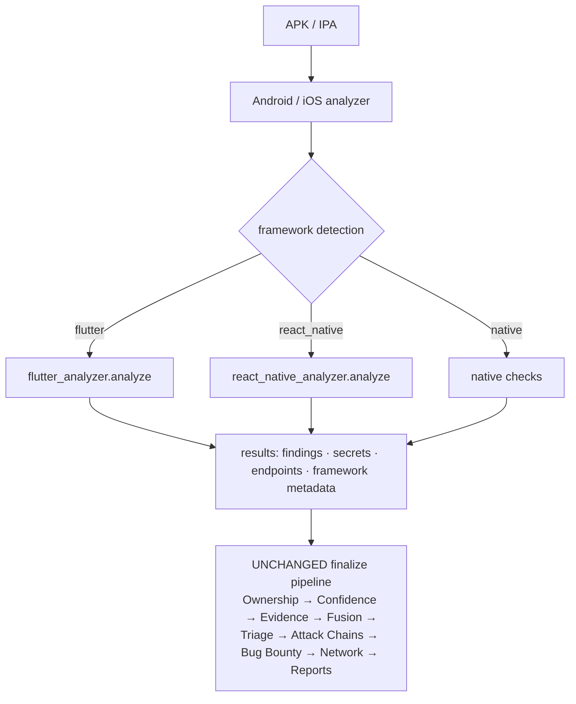

# 19. Framework Intelligence

Modern mobile apps aren't all written in Java/Kotlin or Swift/ObjC. Beetle treats
cross-platform frameworks as **first-class platforms** — but does so *inside* the existing
Android/iOS flow, as sub-analyzers, not parallel pipelines. This chapter covers the four
framework lenses: Android Native, iOS Native, Flutter, and React Native.

---

## 19.1 The core principle: sub-analyzers, one pipeline

A Flutter app *is* an Android APK (`libflutter.so` + `libapp.so` + `flutter_assets`) or an
iOS IPA (`Flutter.framework` + `flutter_assets`). A React Native app *is* an APK/IPA with a
JS/Hermes bundle. So framework analysis is a **sub-analyzer** gated on framework detection,
contributing canonical findings to the *same* streams every other analyzer uses.

The payoff: a Flutter/React Native finding shows **Detected By, Owner, Confidence, Evidence,
Attack Chain, Bug Bounty, Source** — *exactly* like a native finding, with no separate
reporting model. The sub-analyzers call **no** intelligence engine themselves; they only
produce canonical-shaped detections and let the shared pipeline do the work.

---

## 19.2 Android Native

The baseline Android lens (covered across [Ch 2 §2.7](02-system-architecture.md) and
[Ch 4](04-intelligence-engines.md)):

- **Detection:** AndroidManifest, Network Security Config, certificate/signing schemes, regex
  SAST + Semgrep, taint (DEX call graph), ELF hardening, native-lib CVE, trackers/SDKs, API
  usage, OSV dependencies.
- **Capabilities:** full decompilation (JADX + apktool), the only platform with inter-
  procedural taint analysis.
- **Findings/metadata:** the richest finding set; the manifest/component inventory powers most
  attack-chain entry points.
- **Limitations:** SAST quality degrades on obfuscated/minified code; taint is bounded by
  timeout and DEX-size caps.

---

## 19.3 iOS Native

The baseline iOS lens ([Ch 2 §2.8](02-system-architecture.md)):

- **Detection:** Info.plist & entitlements, Mach-O hardening (PIE/NX/canary/ARC/FairPlay),
  LIEF deep analysis (instrumentation dylibs: Frida/Substrate/Objection/…), data storage
  (Keychain/UserDefaults/CoreData/Realm/FileProtection), crypto (CommonCrypto/CryptoKit/weak
  algos), WebView (WK/UIWebView, JS bridges), embedded frameworks, CocoaPods CVE.
- **Capabilities:** binary-centric analysis; entitlement and code-signature inspection.
- **Metadata:** bundle id, SDK versions, capabilities, embedded frameworks.
- **Limitations:** iOS apps aren't decompiled to source like APKs; analysis works over the
  Mach-O, plists, entitlements and bundles. No taint analysis (androguard is Android-only).

> The iOS and Android pipelines share the entire finalize stack, with verified Android==iOS
> output parity in the engine test suites.

---

## 19.4 Flutter Intelligence

`analyzers/flutter_analyzer.py`, gated on the existing `framework == "flutter"` detection
(`libflutter.so`/`libapp.so` on Android, `flutter_assets` on iOS).

**Detection.** A standalone `detect(roots)` also recognizes a `pubspec.yaml` declaring the
Flutter SDK (for the future source-directory input).

**Analysis sources** (whichever are present): `pubspec.yaml`/`pubspec.lock`, `.dart` source
(source/debug builds), `flutter_assets` (`AssetManifest.json`, `kernel_blob.bin`), and the
**printable strings of `libapp.so` / the App snapshot** (release AOT Dart). Harvesting is
bounded by file-count/size caps.

**Findings (data-driven rule catalog — add a tuple, not logic):**

| Area | Detected |
|------|----------|
| **Platform channels** | `MethodChannel` / `EventChannel` / `BasicMessageChannel` (+ channel name) — the native-bridge attack surface |
| **Storage** | Flutter Secure Storage (good), SharedPreferences (plaintext), unencrypted `Hive.openBox`, SQLite/`sqflite` |
| **Network** | `badCertificateCallback => true` / `onBadCertificate => true` (TLS validation disabled — **high**), Dio client, WebSocket / `ws://` |
| **Build/debug** | `kDebugMode` branches, sensitive logging |
| **Dependencies** | pubspec inventory + capability labels (Dio, Hive, Firebase, …) |

**Secrets** are *not* detected by a Flutter-specific detector — harvested Dart text goes to
the shared `scan_text_for_secrets`, so the Secret Intelligence engine classifies/scores/masks
them like any other secret.

**Metadata** (`results["flutter"]`): `build_mode` (debug/release), `has_libapp_snapshot`,
`has_flutter_assets`, `dart_source_files`, `dependencies`, `dependency_capabilities`,
`platform_channels`, and a `project_structure` (lib/assets/android/ios/test/…) that a future
Source Explorer tree consumes.

**Limitations.** Release Flutter is AOT-compiled into `libapp.so`, so detection works over
binary strings (approximate) unless a debug build or source directory is provided.

---

## 19.5 React Native Intelligence

`analyzers/react_native_analyzer.py`, modeled on the Flutter analyzer, gated on
`framework == "react_native"` (`libreactnativejni.so`/`index.android.bundle` on Android;
`main.jsbundle`/`index.ios.bundle` on iOS).

**Relationship to the JS modules (no duplication):** bundle *discovery* is reused from
`js_bundle_analyzer.find_js_bundles`; **generic** JS sinks (`eval`/`Function`/
`dangerouslySetInnerHTML`) stay in `js_bundle_analyzer` (runs for every app); this module
adds the **RN-idiomatic** analysis and replaced the old weak inline RN handler.

**Analysis sources:** JS/Hermes bundles, `package.json`, `metro.config.js`/`babel.config.js`,
`.env`, and `.js`/`.jsx`/`.ts`/`.tsx` source. Hermes bytecode is detected and its string
literals pattern-matched.

**Findings:**

| Area | Detected |
|------|----------|
| **Native bridge** | `NativeModules.<X>` (+ name), TurboModules, `requireNativeComponent`/`codegenNativeComponent` (Fabric), `NativeEventEmitter` |
| **Storage** | AsyncStorage (plaintext), `new MMKV()` without `encryptionKey`, Realm without `encryptionKey`, SQLite/WatermelonDB; EncryptedStorage/SecureStore/Keychain (good) |
| **Network** | `rejectUnauthorized:false` / `trustAllCerts` (TLS disabled — **high**), `react-native-ssl-pinning` (good), axios, WebSocket / `ws://` |
| **Platform** | Deep links (`Linking.*`), Firebase, environment config (`react-native-config`/`process.env`), `__DEV__` |
| **Dependencies** | `package.json` inventory + capability labels |

**Secrets** go through the shared `scan_text_for_secrets` → Secret Intelligence, same as
Flutter.

**Metadata** (`results["react_native"]`): `hermes`, `bundles`, `src_files`, `dependencies`,
`dependency_capabilities`, `native_modules`, and a `project_structure`
(android/ios/src/app/assets/node_modules).

**Limitations.** Production RN bundles are minified; pattern matching is weaker on minified
code, and `.map` source maps are not analyzed.

---

## 19.6 How framework findings become Canonical Findings

Because the sub-analyzers only append to `results["findings"]` / `["secrets"]` /
`["endpoints"]`, the unchanged finalize pipeline processes them automatically:

- **Ownership** classifies each finding's `file_path` (Flutter/RN runtimes are in the
  fingerprint DB — [Ch 14](14-ownership-engine.md)).
- **Confidence** scores them (incl. multi-engine agreement).
- **Evidence / Evidence Selection** picks the best proof file + snippet.
- **Finding Fusion** dedups and credits "Detected By" — a framework finding overlapping a
  native detection fuses into one finding crediting both engines ([Ch 15](15-finding-fusion.md)).
- **Triage / Attack Chains / Bug Bounty / Reports** run unchanged.
- **Network Intelligence** processes framework endpoints/IPs ([Ch 20](20-network-intelligence.md)).

This is proven in the engine tests, which run the *real* Fusion / Ownership / Confidence /
Evidence-Selection engines over generated Flutter and React Native findings.

---

## 19.7 Detection summary

| Framework | Detected by | Source of truth | Decompiled source? |
|-----------|-------------|-----------------|--------------------|
| Android Native | default | DEX/smali/manifest | Yes (JADX + apktool) |
| iOS Native | default | Mach-O/plist/entitlements | No (binary analysis) |
| Flutter | `libflutter.so`/`libapp.so` (Android), `flutter_assets` (iOS) | Dart source / AOT snapshot strings | Debug yes; release = binary strings |
| React Native | `libreactnativejni.so`/`index.android.bundle` (Android), `main.jsbundle`/`index.ios.bundle` (iOS) | JS/Hermes bundle | Bundle (minified in release) |

---

## 19.8 Future

- **Source-directory inputs.** Both framework analyzers accept *arbitrary roots*, so a future
  "Flutter/RN project source directory" scan target is a thin add-on (the `project_structure`
  metadata shape is already populated either way).
- **Framework Analysis view.** A planned Advanced section (Flutter/RN-specific lenses: bundle,
  native libs, framework secrets) — [Ch 5 §5.19](05-dashboard-guide.md).
- **More frameworks.** Cordova/Capacitor/Ionic/Unity/Xamarin are already in the Ownership
  fingerprint DB; dedicated sub-analyzers follow the same one-module pattern.

---

*Next: [Chapter 20 — Network Intelligence](20-network-intelligence.md).*
