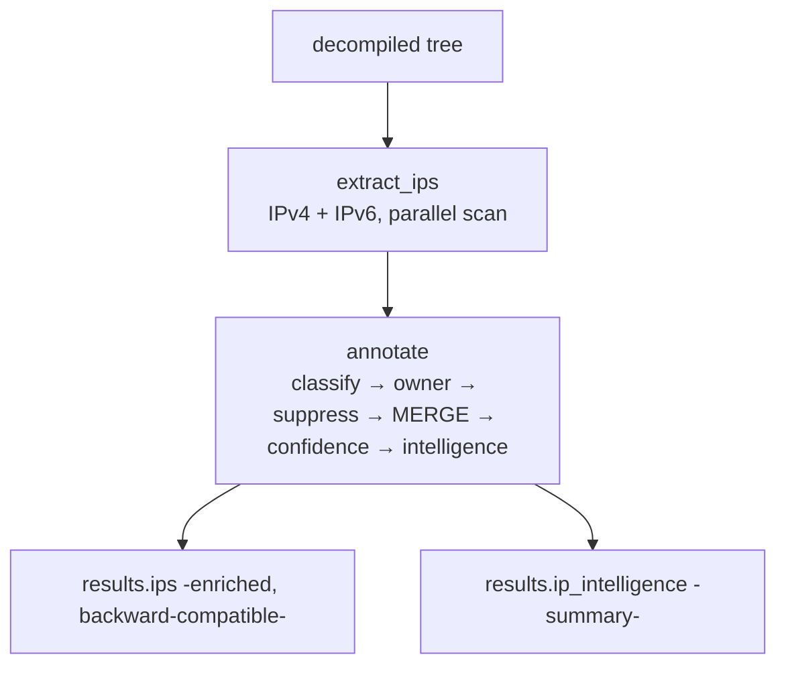

# 20. Network Intelligence

Beetle's Network Intelligence discovers and enriches every network artifact an app
references — URLs, deep links, IP addresses, domains, and cloud backends — and classifies
each by type, owner, confidence and risk. This chapter covers the whole network surface:
URL/endpoint extraction, IP discovery, Firebase/bucket/cloud config, domain enrichment, and
how it all renders.

---

## 20.1 The pieces

| Concern | Module | Output |
|---------|--------|--------|
| URLs / deep links | `endpoint_intel.py` | `results["endpoints"]` |
| IP addresses (v4 + v6) | `network_intel.py` | enriched `results["ips"]` + `ip_intelligence` |
| Cloud config (bare hosts) | `cloud_config.py` | `cloud_config` findings |
| Domain enrichment | `domain_analyzer.py` | geo / OFAC / reputation |
| Live cloud exposure (opt-in) | `cloud_intel.py` | `cloud_exposures` |
| Cloud attack paths | `cloud_correlation.py` | cloud chains |

All of it renders in the **Network** workspace section ([Ch 5 §5.7](05-dashboard-guide.md))
and the PDF Endpoints + Domain Intelligence sections.

---

## 20.2 URL & endpoint extraction

`endpoint_intel.py` is a single extractor used by **both** Android and iOS. It replaced an
older narrow extractor that only scanned a few file types and matched `http(s)://` only
(which once made a release app surface only `http://127.0.0.1`).

- Scans the decompiled tree across **source / resource / config / smali / dart**, reusing the
  evidence scanner's file caps and directory-skip filters.
- Extracts `http / https / ws / wss / ftp / ftps` URLs **plus app-specific custom-scheme deep
  links** (`myapp://…`), excluding platform/spec noise schemes.
- Filters framework/spec noise (`xmlns`, `w3.org`, `schemas.android.com`, …) and validates
  that each endpoint has a real host, keeping false positives low.
- Returns a sorted, de-duplicated list; **Finding Fusion's `merge_endpoint_streams`** then
  unions APKLeaks endpoint hits.

> Endpoints are **informational intelligence, not findings** — broadening coverage never
> inflates the findings false-positive rate. Scheme/host grouping and risk are layered on by
> the Network panel and domain intelligence.

---

## 20.3 IP address discovery

`network_intel.py` is a single canonical IP model shared by Android and iOS (the only
platform input is `platform=`). It restored and **improved** IP discovery: the old path
surfaced IPv4 only, collapsed everything to public/private, attributed no owner, used a fixed
confidence, and missed Swift/ObjC sources.

### Extraction

- **IPv4** via a strict pattern; **IPv6** via a permissive candidate regex (allowing mid-
  address `::`) **validated by the `ipaddress` stdlib** — so times (`12:30:45`) and version
  strings are rejected.
- Extensions cover Java/Kotlin, **Swift/ObjC/`.m`/`.h`/`.plist`** (iOS parity), XML, JSON,
  properties, gradle, YAML, `.conf/.cfg/.ini/.env`, `.strings`, HTML. **Smali is excluded**
  (a hex/`const-wide` false-positive goldmine); binary string-dumps are skipped.

### Classification (full RFC taxonomy)

Every IP is classified by the `ipaddress` stdlib, documentation ranges first:

| Class | Rule |
|-------|------|
| `documentation` | RFC 5737 / RFC 6598 / RFC 3849 |
| `unspecified` | `0.0.0.0` / `::` |
| `loopback` | `127/8`, `::1` |
| `link_local` | `169.254/16`, `fe80::/10` |
| `multicast` | `224/4`, `ff00::/8` |
| `broadcast` | `255.255.255.255` |
| `private` | RFC1918, ULA `fc00::/7` |
| `reserved` | other reserved / non-global |
| `public` | globally routable |

The legacy `type` (`public`/`private`/`internal`) is preserved for backward compatibility,
alongside `classification`, `classification_label` and `version` (4/6).

### Ownership

`annotate` reuses the **Ownership engine** (no second SDK database) — application-owned IPs
score higher confidence; framework/SDK/generated IPs are demoted ([Ch 14](14-ownership-engine.md)).

### Suppression (nothing is dropped)

- **Merge** repeated occurrences of one literal into a canonical entry with `occurrences` +
  `merged_files`.
- **Suppress-by-default** when an IP is noise *and* has no promoting intelligence tag —
  placeholders (`8.8.8.8`, `1.1.1.1`, `10.0.2.2`, …), documentation/test ranges, or
  non-endpoint classes (link-local/multicast/reserved/broadcast/…).
- **Promotion** — any intelligence tag (e.g. a loopback used as a real dev backend) keeps it
  visible.

Suppressed IPs are **kept and counted**; the UI offers a "Show N suppressed (noise)" toggle.

### Confidence

An explainable 5–99 score (not a constant): base 50; `+20` routable endpoint / `−30`
non-endpoint / `−10` loopback; `+20` app-owned / `−25` framework-SDK / `−15` generated; `+12`
network-assignment context in the snippet (`http`/`url`/`host`/`://`/…); `+6` for ≥3
occurrences. `confidence_reason` records every contribution.

### Intelligence tags

`Hardcoded Internal IP`, `Private IP in Release Build`, `Loopback Reference`, `Development
Environment`, `Embedded Backend Address`, `Multiple IP References`.

---

## 20.4 Cloud configuration discovery

`cloud_config.py` (network-free) catches cloud backends the URL extractor misses because the
values are **bare hostnames or non-http URIs** — e.g.
`<string name="google_storage_bucket">damn-vulnerable-bank.appspot.com</string>`. Covers
(vendor-specific, low-FP tokens only):

- Firebase / Google Cloud Storage buckets — `*.appspot.com`, `gs://…`,
  `firebasestorage.googleapis.com/v0/b/<bucket>`, `storage.googleapis.com/<bucket>`.
- Firebase app endpoints — `*.firebaseapp.com`, `*.web.app`.
- Google Cloud Functions — `*.cloudfunctions.net/…`.

It deliberately does **not** re-detect the Firebase Realtime Database URL
(`*.firebaseio.com`) — that is already a first-class secret detector. Cloud-config hits become
"Cloud Configuration" canonical findings, so Ownership / Evidence / Confidence / Fusion
process them like any other finding.

---

## 20.5 Domain enrichment

`domain_analyzer.py` enriches contacted domains (no API key required, via ip-api.com + DNS):

- **OFAC sanctions-country** check (Cuba, Iran, North Korea, Russia, Syria, Venezuela,
  Belarus, Myanmar, Libya, Somalia, Sudan, Yemen, Zimbabwe) → high-severity finding.
- **Suspicious keyword** scoring (dev/stage/qa/uat/test/debug/internal).
- **Suspicious TLD** scoring (`.ru`, `.su`, `.click`, `.top`, `.xyz`, …).
- **Dynamic-DNS** hints (duckdns/no-ip/dynu/…), private-IP detection.

Capped at 30 domains; geolocation is best-effort (CDN/VPN edges can mislocate). No caching
between scans.

---

## 20.6 Live cloud exposure & correlation (opt-in)

Two cooperating modules, off by default and safety-enveloped:

- **`cloud_intel.py`** — enabled only with `CORTEX_ENABLE_CLOUD_INTELLIGENCE` (and not a
  benchmark run, and live checks enabled). Each probe is a *single read-only HTTP GET* with a
  5 s timeout, single attempt, and **never stores sensitive data** (only a masked target +
  HTTP status + method). Produces `cloud_exposures`.
- **`cloud_correlation.py`** — a pure transform correlating secrets + validation state +
  exposures into cloud attack paths: validated credential + confirmed exposure = **HIGH**;
  unvalidated + exposure = **MEDIUM**; credential-only = **LOW** (suppressed by default). It
  references only masked values.

> Live cloud probing touches real services. Keep it disabled unless you are authorized to
> probe the app's backends.

---

## 20.7 What the Network panel shows

For **endpoints/URLs/deep links/domains**: the destination, scheme/host grouping, and any
domain-intelligence risk (geo/OFAC/reputation).

For **IPs** (IPs tab): each IP with its **Classification**, **Owner** (color-coded),
**Confidence %**, source **file:line**, occurrence count, and **intelligence tags** — plus the
"Show N suppressed" toggle. The URL section is untouched by the IP work; IP discovery sits
beneath it.

*Insert screenshot of the Network section (IPs tab) here.*

---

## 20.8 Limitations

- Extraction is static — runtime-constructed URLs/IPs (concatenated at runtime, decrypted, or
  fetched remotely) are invisible to static analysis.
- Domain enrichment depends on a free third-party geo service (rate-limited, no SLA) and live
  DNS at scan time.
- Minified/obfuscated code reduces endpoint/IP recall.

---

*Next: [Chapter 21 — Source Explorer](21-source-explorer.md).*
