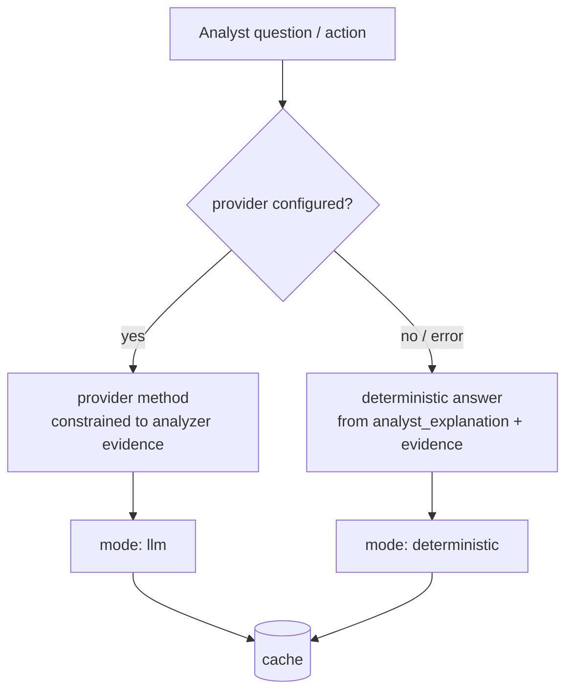

# 22. AI

Beetle's AI layer helps an analyst *reason about* the evidence the deterministic engines have
already produced — it never replaces them, and it never invents findings. This chapter
documents the AI Assistant, the one-shot AI finding actions, "Review with AI," and the hard
guardrails that keep AI output trustworthy, plus the direction of future AI security.

---

## 22.1 The cardinal rules

Every AI surface in Beetle obeys the same hard rules:

> - **AI reasons over analyzer evidence ONLY.** It never rediscovers vulnerabilities, never
>   invents attack chains, code, paths, or parameters.
> - **AI never mutates results.** It never suppresses findings, never auto-marks false
>   positives, never changes severity or scores. **The human analyst is the final authority.**
> - **Every answer carries a `mode`** (`llm` or `deterministic`) so analyzer evidence and AI
>   reasoning stay distinguishable.
> - **Offline-safe.** With no provider configured, every AI feature degrades to a
>   *deterministic, evidence-only* answer built from the analyzer's own data — no network is
>   touched.

This is why AI in Beetle is safe to use on a real engagement: it is a reasoning aid grounded
in the same evidence you can inspect, not an unbounded oracle.

---

## 22.2 AI Assistant (Ask-AI)

`ai_chat.py` — a conversational layer over the analyzer evidence.

- **Auto-context.** The analyst never pastes evidence; the assistant builds a *summarized*
  context automatically from the scan (findings, secrets, chains, analyst explanations).
- **Multi-finding reasoning.** It can reason across several findings at once (e.g. "do these
  three combine into a risk?") — but only over evidence already present.
- **Persistent.** Conversations are stored per scan and survive a restart.
- **Cached.** Reuses the AI cache so repeated questions don't re-bill the provider.
- **Deterministic fallback.** With no provider, it answers from the deterministic analyst
  intelligence ([Ch 4 §4.23](04-intelligence-engines.md)) and the evidence — clearly marked
  `mode: deterministic`.

Typical uses: "explain this finding in plain language," "what's the worst attack path here,"
"how would I verify the hardcoded secret," "summarize the crypto issues for a developer."

*Provider selection — choose an AI provider or Beetle's deterministic offline analysis:*

*A grounded AI response — contextual explanation, attack reasoning and remediation:*

---

## 22.3 AI Actions (the Finding Drawer)

`ai_actions.py` — one orchestrator (`run_action`) powering five one-shot actions on a finding
plus the executive summary. It is provider-agnostic and offline-safe.

| Action | What it produces |
|--------|------------------|
| **Explain** | A plain-language explanation of the finding and why it matters. |
| **Verify** | An advisory assessment of whether the finding looks real. **Advisory only** — the deterministic verify always reports `false_positive=false` and says so; it never auto-dismisses. |
| **Worth Testing** | Whether this is worth a manual test / PoC, given reachability and reportability. |
| **Generate PoC** | A proof-of-concept *outline* grounded in the finding's evidence. |
| **Generate Fix** | A concrete remediation suggestion. |

Behavior:

- If a provider is configured and available, the matching provider method runs — and the model
  is constrained to reason **only** about the analyzer evidence (see `providers/base`).
- Otherwise (or on provider error / non-JSON) it falls back to a **deterministic** result
  built strictly from the analyzer's own evidence (`analyst_explanation`, reachability,
  snippet, MASVS, …). Nothing is invented; no network is touched.
- Responses are **cached** in SQLite (`ai_action_cache`, keyed on action + provider + model +
  evidence) and the orchestrator **never raises** into the request handler.

---

## 22.4 Review with AI

"Review with AI" on a finding is not a separate page — it **opens the AI Assistant with that
finding loaded** as context, so a one-shot question can flow naturally into a conversation. (A
standalone AI Reviewer page was intentionally removed in favor of this integration —
[Ch 5 §5.1](05-dashboard-guide.md).)

---

## 22.5 AI Enrichment (per-finding, at scan time)

Separately from the interactive surfaces, `ai_enrichment.py` can enrich findings at scan time
with contextual explanations/remediation using a fast model (Claude Haiku), with a 7-day
SQLite cache keyed on the finding's content hash. It degrades gracefully: with no
`ANTHROPIC_API_KEY`, findings are simply left unchanged. Enrichment is additive and per-
finding; it never alters severity or scores.

---

## 22.6 Providers

The AI layer is **provider-agnostic**. A provider implements a small interface; the
orchestrator selects a configured provider or falls back to deterministic mode. The default
integration uses Claude models (e.g. `claude-haiku-4-5` for fast enrichment); the assistant/
actions can use a more capable model when configured. Provider selection and keys are
configuration, not code — and the absence of any provider is a fully supported mode.

---

## 22.7 Why the constraints matter (interpretation)

- **Trust the `mode` tag.** An `llm` answer is reasoning; a `deterministic` answer is the
  analyzer's own evidence restated. Both are useful; knowing which is which prevents treating
  a model's prose as a new finding.
- **AI `verify` is a hint, not a verdict.** It can point you at why a finding might be a false
  positive, but Beetle will not mark it FP for you — that decision (and the collaboration
  state) is the analyst's ([Ch 5 §5.20](05-dashboard-guide.md)).
- **A generated PoC is a starting outline** grounded in evidence — validate it before use, and
  only against systems you're authorized to test.
- **No data leaves without a provider.** If you require strict offline operation, run with no
  provider key; every AI feature still works in deterministic mode.

---

## 22.8 Future: AI Security

The architecture is built so AI becomes *another evidence-grounded engine*, never an
unconstrained one:

- **AI Reviewer.** Consume the Confidence/Evidence breakdowns and Triage `NeedsHumanReview`
  items as grounded context, and `register()` refinement rules into Triage / Attack Chains
  ([Ch 4 §4.17](04-intelligence-engines.md), [Ch 12](12-attack-chains.md)) — focusing model
  attention on low-confidence items rather than re-deriving findings.
- **AI detection sources.** An AI detector that *emits canonical findings* flows through
  Finding Fusion like any other engine ([Ch 15](15-finding-fusion.md)) — corroborating or
  being corroborated by deterministic detectors, with the same provenance and explainability.
- **Determinism preserved.** Because the deterministic engines remain the source of truth and
  every AI output is mode-tagged and evidence-grounded, adding AI never compromises Beetle's
  explainability or reproducibility.

---

*Next: [Chapter 23 — Reports for Different Audiences](23-audience-reports.md).*
