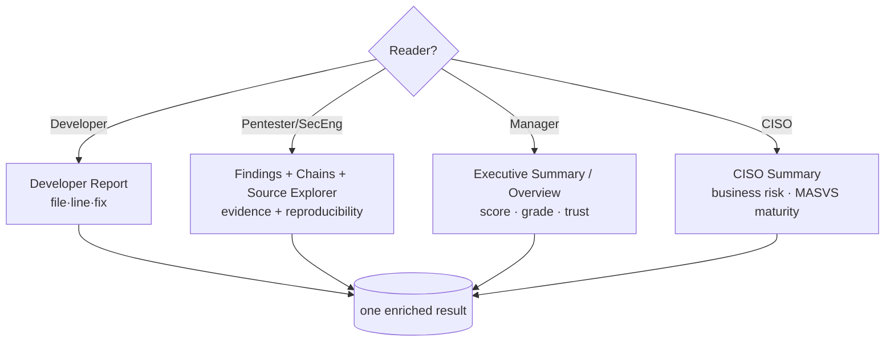

# 23. Reports for Different Audiences

The same scan serves very different readers. A developer needs a file, a line and a fix; a
CISO needs business risk and a one-paragraph verdict; a security engineer needs evidence and
exploitability. Beetle renders the *same enriched result* into audience-specific views so each
reader gets what they need without wading through the rest. This chapter explains each
audience report, what it emphasizes, and how to use it.

---

## 23.1 The audiences and where their report lives

| Audience | In-app section | PDF section | Built from |
|----------|----------------|-------------|-----------|
| **Developers** | Developer Report | Developer Summary (§7) | `report/report_summaries.py` |
| **Security engineers / pentesters** | Findings + Attack Chains + Source Explorer | Findings, Attack Chains, Taint, Evidence | the full pipeline |
| **Management** | Overview | Executive Summary (§1) | scoring + severity rollup |
| **CISO** | CISO Summary | CISO Summary (§2) | `ciso_summary` |

All four are projections of one result, so they never disagree — the CISO's "High risk" and
the developer's fix list describe the same findings at different altitudes.

---

## 23.2 Developer Summary / Developer Report

**Intended for:** the engineers who will fix the issues.

**Emphasis:** *what to change, where, and how.* It is fix-oriented and de-noised:

- Findings grouped for engineering action, prioritized by what actually matters
  (severity × reachability × confidence), with **application-owned** issues first — Triage's
  hidden-by-default library/framework noise is collapsed ([Ch 4 §4.17](04-intelligence-engines.md)).
- Each item carries the **exact `file:line`**, the **renderable evidence snippet**, the
  **analyst remediation** (how to verify, how to fix), and the standards mapping (CWE/MASVS/
  OWASP).
- **View Code** jumps straight to the line in the Source Explorer ([Ch 21](21-source-explorer.md)).

**How a developer uses it:** work top-down; for each item, open the evidence, confirm it's
real (the AI *verify* action can help — [Ch 22](22-ai.md)), apply the suggested fix, and use
**Scan Compare** ([Ch 5 §5.17](05-dashboard-guide.md)) after the next build to confirm the
finding is gone and nothing regressed.

---

## 23.3 Security Engineer / Pentester view

**Intended for:** the analyst running the assessment.

This isn't a single "summary" — it's the full investigative workspace, because the security
engineer needs *everything*:

- **Findings** with the complete intelligence badge set — severity, confidence, ownership,
  fusion/detected-by, reachability, bug-bounty reportability.
- **Attack Chains** — the realistic attacker journeys, with per-step evidence to reproduce
  ([Ch 12](12-attack-chains.md)).
- **Source Explorer / Security Explorer** — read the exact code, pivot by security category.
- **Evidence & reproduction** — every finding's `evidence_bundle` with "how to reproduce"
  ([Ch 13](13-evidence-engine.md)).
- **Bug Bounty reportability** — `review_priority` (P1–P4) and `recommended_next_step` to
  decide what's worth a write-up ([Ch 4 §4.22](04-intelligence-engines.md)).

**How they use it:** triage with the Findings filter (high severity, high confidence,
reachable, application-owned), start from the Most Exploitable Chain, reproduce via the
evidence references, and let reportability + reachability decide the final report contents.

---

## 23.4 Management / Executive Summary

**Intended for:** engineering managers and non-security stakeholders.

**Emphasis:** *how bad, how confident, what's the headline.* The Executive Summary and the
Overview dashboard lead with the **Security Score + grade**, the **severity breakdown**, the
**Trust Score**, and the **Risk Rating** — the headline trio read together
([Ch 6 §6.3](06-scoring-systems.md)) — plus the top risks. It avoids per-line detail.

**How they use it:** a single grade and risk word for a status update, with the severity bar
showing scale. The Trust Score is the honesty check — a clean grade on a low-trust scan is
flagged as "we couldn't see much," not "it's safe" ([Ch 8](08-trust-score.md)).

---

## 23.5 CISO Summary

**Intended for:** security leadership and risk owners.

**Emphasis:** *business risk and posture, in non-technical language.* The CISO Summary
(`ciso_summary`) leads with the **Risk Rating**, the **MASVS maturity** label
([Ch 17](17-masvs-coverage.md)), the top concerns framed as business impact, and the
attack-chain picture (what an attacker could actually achieve). It is the bridge between the
technical findings and an organizational risk decision.

**How they use it:** answer "should we ship / what's our exposure / where do we invest." The
MASVS maturity points to *which capability area* is weakest (e.g. "network security maturity
is weak"), guiding remediation investment beyond individual findings.

---

## 23.6 Choosing the right report

| Need | Use |
|------|-----|
| "Fix this." | Developer Report / Developer Summary |
| "Prove and prioritize it." | Findings + Attack Chains + Evidence + Bug Bounty |
| "Brief my manager." | Executive Summary / Overview |
| "Inform a risk decision." | CISO Summary + Compliance PDF |
| "Feed a pipeline." | SARIF / JSON ([Ch 16](16-reports.md)) |
| "Supply-chain review." | CycloneDX SBOM ([Ch 16 §16.5](16-reports.md)) |
| "Audit deliverable." | Compliance PDF ([Ch 16 §16.4](16-reports.md)) |

---

## 23.7 Consistency guarantee

Because every audience report is a rendering of the same fused, triaged, scored result:

- A finding hidden-by-default in the Developer Report is still present in the full JSON and the
  pentester's Findings view (revealable) — nothing is *lost*, only *prioritized per audience*.
- The CISO's Risk Rating, the manager's grade, and the developer's fix list are guaranteed to
  describe the same underlying findings.
- Re-running the scan produces deterministic, versioned scores, so audience reports are
  comparable release-over-release.

---

*Next: [Chapter 24 — FAQ](24-faq.md).*
